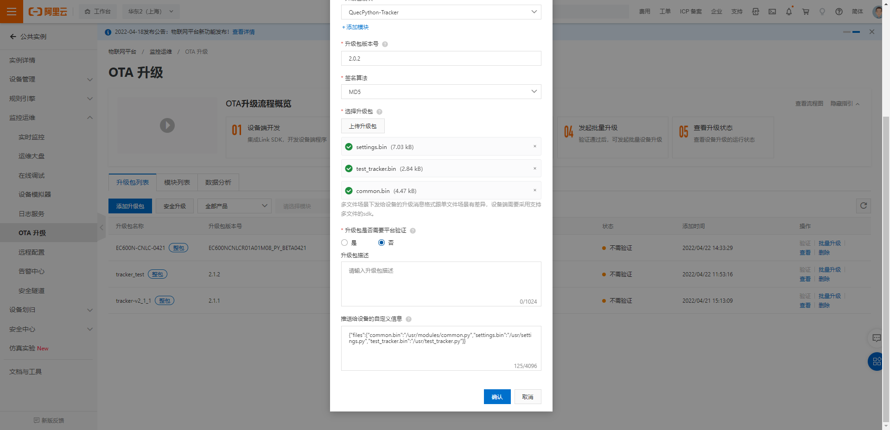
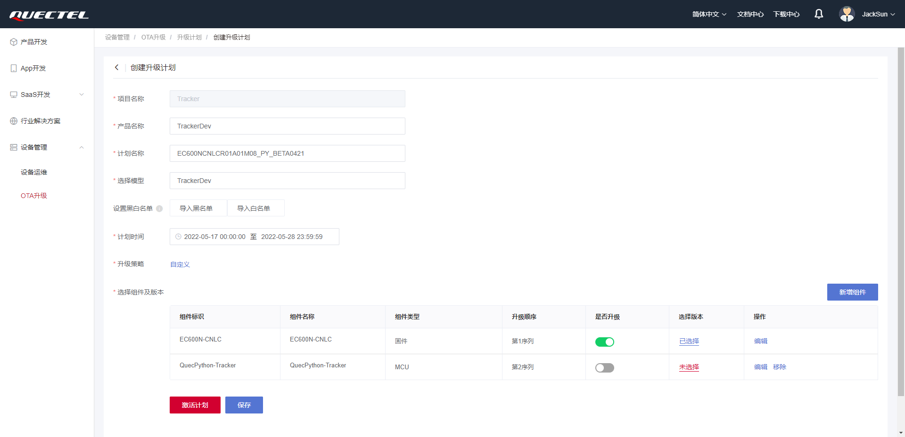

# DTU OTA升级用户指导手册

## OTA升级

> **固件升级只支持差分升级，不支持整包升级**

### 阿里云

> **项目文件升级包，以修改项目代码文件后缀名为`.bin`的方式做成升级包，上传云端，可上传多个文件**

#### 固件升级

1. 制作固件升级差分包(联系固件开发人员);
2. 创建OTA模块，以设备平台名称命名，如: `EC600N-CNLC`.

3. 创建OTA升级包

4. 选择批量升级, 创建升级计划

5. 等待设备升级，查看升级结果

    + 当设备开启OTA升级和OTA自动升级，则等待设备升级完成，查看升级结果;
    + 当设备开启OTA升级，但未开启自动升级时，可通过在线调试模块下发`user_ota_action=1`的物模型设置指令，进行OTA升级。

#### 项目升级

1. 创建OTA模块，以`settings.py`中`PROJECT_NAME`命名，如: `QuecPython-Tracker`.

2. 将需要升级的项目文件后缀名修改为`.bin`
3. 创建OTA升级包
    + 此处需要在**推送给设备的自定义信息**中编写升级文件名对应的设备全路径文件名, 如: `{"files":{"common.bin":"/usr/modules/common.py","settings.bin":"/usr/settings.py","test_tracker.bin":"/usr/test_tracker.py"}}`

4. 选择批量升级, 创建升级计划

5. 等待设备升级，查看升级结果

    + 当设备开启OTA升级和OTA自动升级，则等待设备升级完成，查看升级结果;
    + 当设备开启OTA升级，但未开启自动升级时，可通过在线调试模块下发`user_ota_action=1`的物模型设置指令，进行OTA升级。

### 移远云

> **项目文件升级包，建议以压缩包的形式打包多个项目文件上传云端**

#### 固件升级

1. 制作固件升级差分包(联系固件开发人员);
2. 创建OTA升级模型，添加固件组件，MCU组件(用于项目升级)
    + 固件类型的组件标识以设备平台名称命名，如: `EC600N-CNLC`.
    + MCU类型的组件标识以`settings.py`中`PROJECT_NAME`命名，如: `QuecPython-Tracker`.

3. 创建固件版本升级包

4. 创建固件升级计划

5. 等待设备升级，查看升级结果

    + 当设备开启OTA升级和OTA自动升级，则等待设备升级完成，查看升级结果;
    + 当设备开启OTA升级，但未开启自动升级时，可通过在线调试模块下发`user_ota_action=1`的物模型设置指令，进行OTA升级。

#### 项目升级

1. 将项目文件打包成压缩包，打包指令: `tar -zcvf sotaFile.tar.gz *.py`;
2. 创建OTA升级模型，添加固件组件，MCU组件(用于项目升级)
    + 固件类型的组件标识以设备平台名称命名，如: `EC600N-CNLC`.
    + MCU类型的组件标识以`settings.py`中`PROJECT_NAME`命名，如: `QuecPython-Tracker`.

3. 如果在创建OTA模型时未创建MCU组件，可在模型中添加组件

4. 创建项目版本升级包

4. 创建项目升级计划

5. 等待设备升级，查看升级结果

    + 当设备开启OTA升级和OTA自动升级，则等待设备升级完成，查看升级结果;
    + 当设备开启OTA升级，但未开启自动升级时，可通过在线调试模块下发`user_ota_action=1`的物模型设置指令，进行OTA升级。

