# **DTU上手说明_V1.0**


## 1.基本概述

本文档主要基于介绍DTU上手使用说明。

## 2.使用前准备

### 2.1 在NANO SIM卡座中插入SIM卡

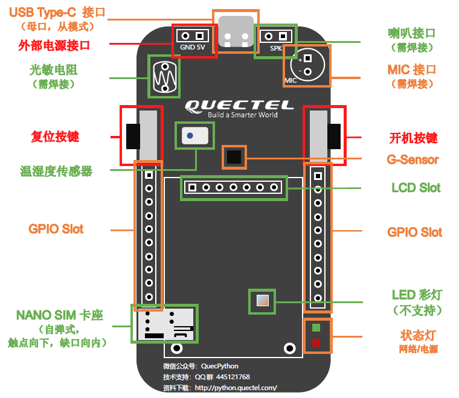

### 2.2. 将天线插入至开发板背面标注为"LTE"的插座中，并用力压紧直到听到"啪"一声

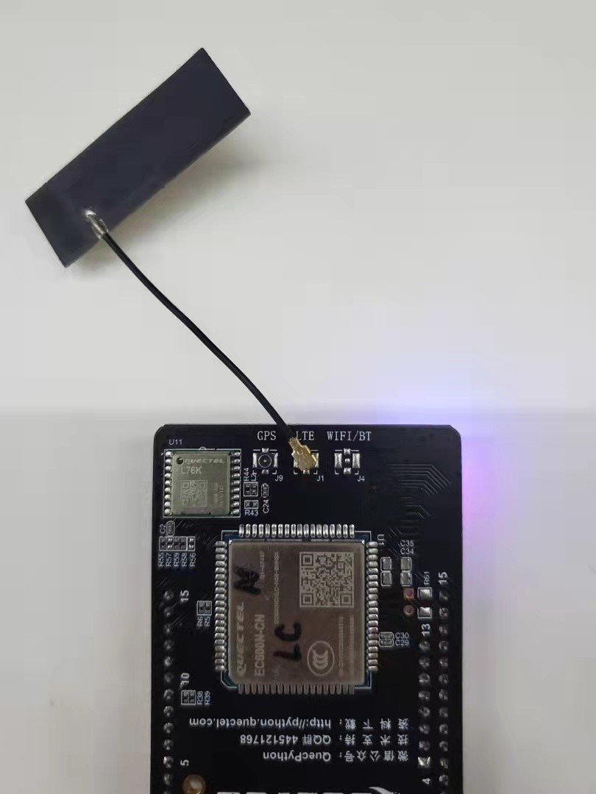

### 2.3. 使用USB数据线连接开发板至电脑USB接口
### 2.4. 设备开机与QPYcom下载请点击以下连接查看说明

[QuecPython开发环境搭建](https://python.quectel.com/doc/doc/Quick_start/zh/QuecPythonStart/dev_env.html)

## 3. DTU固件、配置文件加载到开发板

### 3.1 打开代码库中的DTU文件夹，按需求编写配置文件

**配置文件格式与说明如下**

```json
{
  "plate": 1,									//是否在报文中添加IMEI
  "password": "123",							//设置密码
  "conf": {									//设置在线连接
    "1": {										//通道序号
        //HTTP连接设置
        "protocol": "http",						//连接类型，固定为http
        "method": "get",						//请求方式
        "url": "http://httpbin.org/get",		//请求url
        "reg_data": "",							//附带的固定文本
        "timeout": "",							//超时
        "serialID": 1							//捆绑的串口(1-2),需要为配置文件中uconf中存在的key
    },
    "2": {
        //TCP&UDP连接设置
        "protocol": "tcp",						//连接类型,TCP填写”tcp”,UDP填写”udp”
        "ip_type":"IPv4",
        "server": "220.180.239.212",
        "port": "18011",
        "keep_alive": 5,
        "serialID": 2							//捆绑串口,需要为配置文件中uconf中存在的key
    },
    "3": {
        //mqtt连接设置
        "protocol": "mqtt",						//连接类型
        "clientID": "test_mqtt",				//客户端id
        "keepAlive": "",						//keep alive超时
        "url": "mq.tongxinmao.com",			//url
        "port": "18830",						//端口
        "cleanSession": "0",					//clean session
        "subscribe": {"0": "/public/TEST/python"},	//订阅的主题(支持多个)
        "publish": {"0": "/public/TEST/python"},		//发布的主题(支持多个)
        "qos": "0",								//QoS
        "retain": "1",							//是否使用内部重连
        "serialID": "1"							//捆绑的串口
},
    "4": {
    //阿里云连接设置
        "protocol": "aliyun",					//连接类型
        "type": "mos",							//一机一密/一型一密设置
        "keepAlive": "",						// keep alive超时
        "clientID": " test_mos ",				//客户端id
        "Devicename": " light01",				//设备名称
        "ProductKey": " a1QNbCDxIWM ",			//product key
        "DeviceSecret": "0bceb8010ade0df2e6989982e63f7601",		//device secret
        "ProductSecret": "",					//product secret
        "cleanSession": false,					//clean session
        "qos": "1",								//QoS
        "subscribe": {"0": "/a1QNbCDxIWM/light01/user/get"},		//订阅的主题(支持多个)
        "publish": {"0": "/a1QNbCDxIWM/light01/user/update"},	//发布的主题(支持多个)
        "serialID": "1"							//捆绑的串口
    },
    "5": {
    //腾讯云设置
        "protocol": "txyun",
        "type": "mos",
        "keepAlive": "",
        "clientID": "test_tx_mos",
        "Devicename": "Smart_test01",
        "ProductKey": "H7MBLRYXN9",
        "DeviceSecret": "89c7tXT3s3grZTr/YFjxSg==",
        "ProductSecret": "",
        "cleanSession": false,
        "qos": "1",
        "subscribe": {"0": "H7MBLRYXN9/Smart_test01/control"},
        "publish": {"0": "H7MBLRYXN9/Smart_test01/event"},
        "serialID": "1"
    },
    "6": {
        //移远云设置
        "protocol": "quecthing",                //连接类型
        "keepAlive": "",                        //心跳时间
        "ProductKey": "p1118c",                 //product key 
        "ProductSecret": "c3Jzd3ZaNzVrV2Vj",    //product secret
        "qos": "1",                             //qos
        "SessionFlag": false,                   //是否采用session加密
        "sendMode": "phy",                      //发送模式
        "serialID": "1"                         //捆绑的串口
    }
  },
  "reg": 1,							//发送登陆消息
  "convert": 0,
  "version": 100,						//参数版本号
  "nolog": 0,							//是否输出log
  "message": {},						//协议短信透传
  "uconf": {							//串口设置
    "1": {                              //key为UART编号,使用UART0填入：“0”，使用UART1则填入“1”，以此类推；同时，
                                          //该值同时在通道配置的serialID项中使用
      "baudrate": "115200",
      "databits": "8",
      "parity": "0",
      "stopbits": "1",
      "flowctl": "0"
    },
    "2": {
      "baudrate": "115200",
      "databits": "8",
      "parity": "0",
      "stopbits": "1",
      "flowctl": "0"
    }
  },
  "fota": 1,						//是否启用fota
  "pins": [						//启用的pio
    "pio1",
    "pio2",
    "pio3"
  ],
  "direction_pin": {},			//需要控制的方向的GPIO与默认方向
  "apn": [							//APN设置
    "",
    "",
    ""
  ],
  "service_acquire": 0,			//是否开启服务器获取参数
  "work_mode": "command",			//工作模式
  "auto_connect": 1,				//自动连接
  "offline_storage": false,		//离线存储
  "modbus": {                   //modbus配置
      "groups": [             //设备分组,分组编号为其在列表中的下标,从0开始,以此类推
        {
          "device_type": "temp_humid_sensor",     //设备类型
          "device_model": "TH10S-B",              //设备型号
          "slave_address":["0x01"]                //群组modbus地址,可以填入多个地址
        },
        {
          "device_type": "light_sensor",
          "device_model": "YGC-BG-M",
          "slave_address":["0x02", "0x03"]
        }
      ]
  }
}


```

配置文件中"serialID"字段配置说明：

conf通道配置中的“serialID”字段为捆绑的UART口编号，serialID中的数值必须是uconf串口配置中已经配置的UART口编号

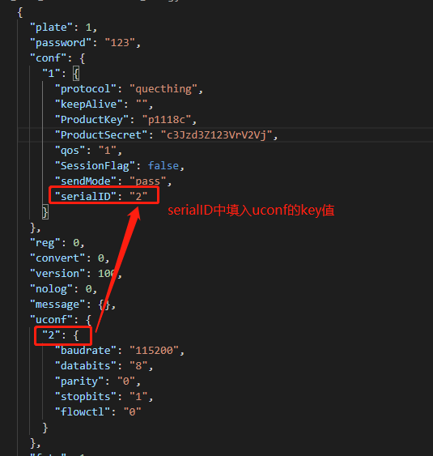


按需求编写配置文件后将配置文件保存为"dtu_config.json"，并保存至DTU代码库中的"dtu"文件夹内

**注：json文件保存前需要移除注释**

### 3.2 下载代码到设备

#### 3.2.1 接上数据线，连接至电脑，短按开发板上的"PWK"按键启动设备，并在QPYcom上选择MI05接口连接


#### 3.2.2 切换到下载选项卡，点击创建项目，并输入任意项目名称


#### 3.2.3 将代码包"dtu"文件夹内所有文件拖入此框内，并应包含图示文件


#### 3.2.4 单击箭头，选择"下载脚本"，并等待下载完成

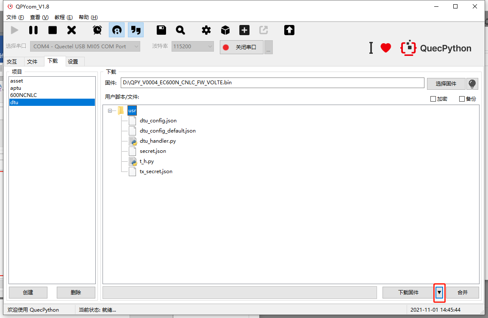

#### 3.2.5 切换至"文件"选项卡，在右边选中"dtu\_handler.py"，点击运行按钮，即可开始dtu调试运行，如果需要上电自动运行，只需要将"dtu\_handler.py"更名为"main.py"即可实现上电自动运行

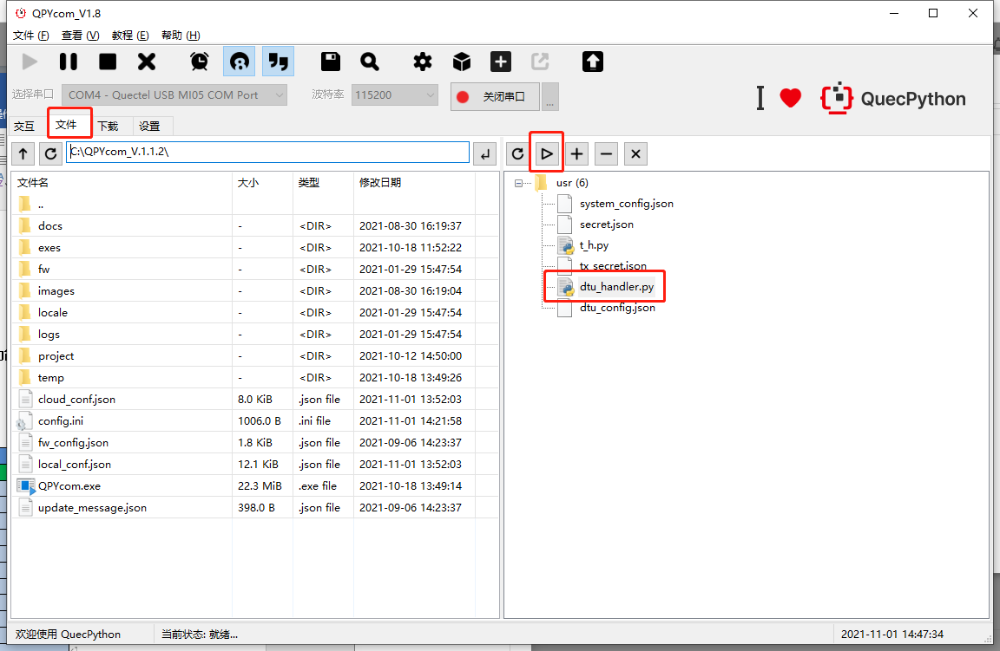

## 4. 重启开发板

上面的步骤完成之后，选择USB MI05 COM Port（老版本是USB串行设备），打开串口。

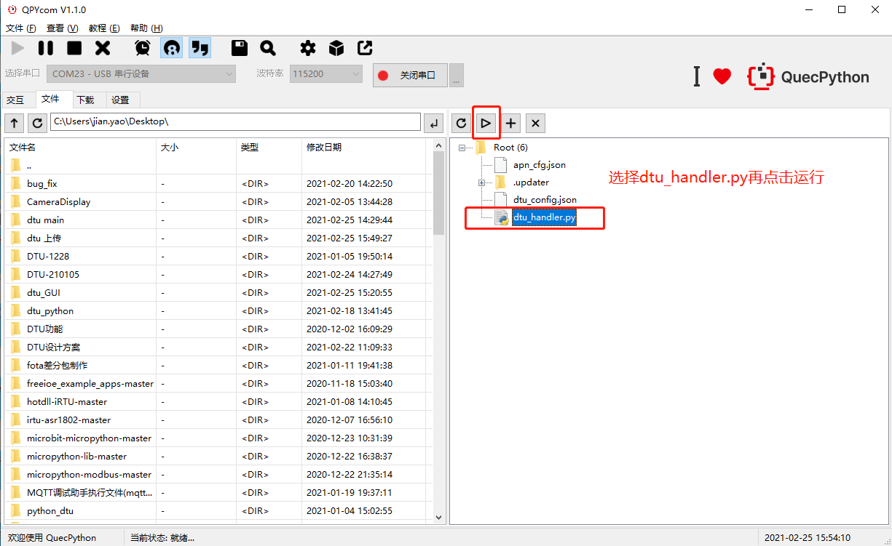

DTU运行成功，下面为读取的配置文件。

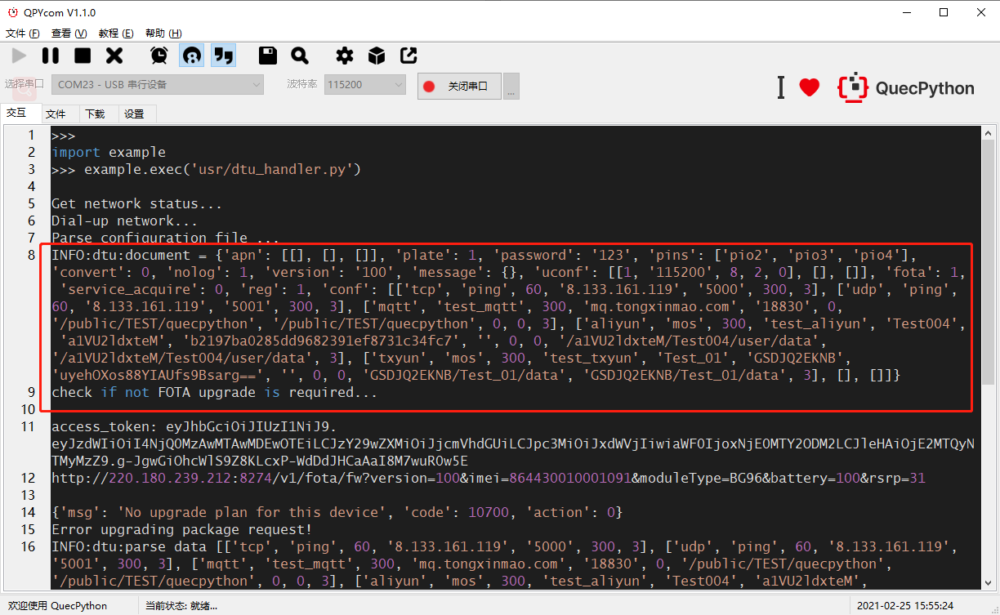

## 5 .报文格式

### 5.1 命令模式

支持多通道透传，通过配置文件中的serialID字段可以对通道与串口进行绑定，每个串口均支持绑定多个通道。在发送数据时需要传入通道id，DTU会向指定的通道发送数据。

在命令模式与modbus模式下，接受到的报文会先进行命令解析，如果解析失败才会向串口传输数据。

#### 5.1.1 TCP/UDP

- 上行数据报文格式:

`"<channel_id>,<msg_len>"[,"<crc32>",”<msg_data>”]`

- 下行数据报文格式:

`"<channel_id>,<msg_len>"[,"<crc32>",”<msg_data>”]`

- 字段说明：

channel_id：通道id，配置文件中通道id

msg_len：消息体长度，字符串格式，可以为0

crc32：消息数据crc32校验码，当msg_len为0时，此项可省略

msg_data：消息体，当msg_len为0时，此项可省略

**示例报文：**

- 上行报文：

`“1,6,1398235801,abcedf”`	(msg_len不为0)

`“1,0”`			(msg_len为0)

- 下行报文：

`“1,6,2584251182,ijklmn”`

#### 5.1.2 HTTP

- 上行数据报文格式:

`"<channel_id>,"<request_id>",<msg_len>"[,"<crc32>",”<msg_data>”]`

- 下行数据报文格式:

`"<channel_id>,"<request_id>",<msg_len>"[,"<crc32>",”<msg_data>”]`

- 字段说明：

channel_id：通道id，配置文件中通道id

request_id: 请求id，配置文件中对应不同的url和method

msg_len：消息体长度，字符串格式，可以为0

crc32：消息数据crc32校验码，当msg_len为0时，此项可省略

msg_data：消息体，当msg_len为0时，此项可省略

**示例报文：**

- 上行报文：

`“1,1,6,1398235801,abcedf”`	(msg_len不为0)

`“1,1,0”`			(msg_len为0)

- 下行报文：

`“1,1,6,2584251182,ijklmn”`

#### 5.1.3 MQTT/Aliyun/Txyun

- 上行数据报文格式:

`"<channel_id>,<topic_id>,<msg_len>","<crc32>",<msg_data>"`

- 下行数据报文格式:

`"<channel_id>,<topic_id>,<msg_len>","<crc32>",<msg_data>"`

- 字段说明：

channel_id：通道id，配置文件中通道id

topic_id：mqtt通道topic_id，上行为publish topic id，下行为subscribe topic id

msg_len：消息体长度，字符串格式，可以为0

crc32：消息数据crc32校验码，当msg_len为0时，此项可省略

msg_data：消息体，当msg_len为0时，此项可省略

**示例报文：**

- 上行报文：

`“1,1,6,1398235801,abcedf”`

- 下行报文：

`“1,1,6,2584251182,ijklmn”`

#### 5.1.4 quecthing

- 上行数据报文格式:

`"<channel_id>,<pkgid>,<msg_len>","<crc32>",<msg_data>"`

- 下行数据报文格式:

`"<channel_id>,<pkgid>,<msg_len>","<crc32>",<msg_data>"`

- 字段说明：

channel_id：通道id，配置文件中通道id

pkgid：quecthing物模型pkgid，透传模式上行、下行报文与物模型上行非应答报文时该字段固定值为0

msg_len：消息体长度，字符串格式，可以为0

crc32：消息数据crc32校验码，当msg_len为0时此项也不可省略

msg_data：消息体，当msg_len为0时此项也不可省略

**示例报文：**

- 上行报文：

`“1,0,6,1398235801,abcedf”`     (透传&物模型非应答)

`“1,16929,6,1398235801,abcedf”`     (物模型应答)

- 下行报文：

`“1,0,6,2584251182,ijklmn”`   (透传报文)

`“1,16930,6,2584251182,ijklmn”`    (物模型报文)

#### 5.1.5 从串口执行控制命令

- 上行命令报文格式:

`"<identify>,<msg_len>","<crc32>",<msg_data>"`

- 下行命令报文格式:

`"<msg_len>","<crc32>",<msg_data>"`

- 字段说明：

identify: 串口控制命令识别码，固定值为"99"

msg_len：消息体长度，字符串格式，可以为0

crc32：消息数据crc32校验码，当msg_len为0时此项也不可省略

msg_data：消息体，当msg_len为0时此项也不可省略

- 上行报文：

`“99,6,1398235801,abcedf”`

- 下行报文：

`“99,6,2584251182,ijklmn”`


### 5.2 透传模式

支持MQTT/TCP/UDP/HTTP双通道透传（串口1&amp;串口2），透传模式每个串口仅支持绑定一个通道，可在配置文件中配置serialID对通道和串口进行绑定。透传模式如果串口配置了多个通道，只会选择第一个通道配置，后面的配置都会被忽略。

透传模式传输时无需在数据格式上传入channel\_id，DTU会自动向串口绑定通道发送数据。


#### 5.2.1 TCP/UDP

- 上行数据报文格式:

`"<msg_len>"[,"<crc32>",”<msg_data>”]"`

- 下行数据报文格式:

`"<msg_len>"[,"<crc32>",”<msg_data>”]"`

- 字段说明：

msg_len：消息体长度，字符串格式，可以为0

crc32：消息数据crc32校验码，当msg_len为0时，此项可省略

msg_data：消息体，当msg_len为0时，此项可省略

**示例报文：**

- 发送报文：

`“6,1398235801,abcedf”`	(msg_len不为0)

`“0”`			(msg_len为0)

- 返回报文：

`“6,2584251182,ijklmn”`

#### 5.2.2 HTTP

- 上行数据报文格式:

`"<request_id>","<msg_len>"[,"<crc32>",”<msg_data>”]"`

- 下行数据报文格式:

`"<request_id>","<msg_len>"[,"<crc32>",”<msg_data>”]"`

- 字段说明：

request_id: 请求id，配置文件中对应不同的url和method

msg_len：消息体长度，字符串格式，可以为0

crc32：消息数据crc32校验码，当msg_len为0时，此项可省略

msg_data：消息体，当msg_len为0时，此项可省略

**示例报文：**

- 发送报文：

`“1,6,1398235801,abcedf”`	(msg_len不为0)

`“1,0”`			(msg_len为0)

- 返回报文：

`“1,6,2584251182,ijklmn”`

#### 5.2.3 MQTT/Aliyun/Txyun

- 上行数据报文格式:

`<topic_id>,<msg_len>,<crc32>,<msg_data>`

- 下行数据报文格式:

`<topic_id>,<msg_len>,<crc32>,<msg_data>`

- 字段说明：

topic_id：mqtt通道topic_id，上行为publish topic id，下行为subscribe topic id

msg_len：消息体长度，字符串格式，可以为0

crc32：消息数据crc32校验码，当msg_len为0时此项也不可省略

msg_data：消息体，当msg_len为0时此项也不可省略

**示例报文：**

- 发送报文：

`“0,4,3632233996,test”`

- 返回报文：

`“0,4,3632233996,test”`

#### 5.2.4 quecthing

- 上行数据报文格式:

`"<pkgid>,<msg_len>","<crc32>",<msg_data>"`

- 下行数据报文格式:

`"<pkgid>,<msg_len>","<crc32>",<msg_data>"`

- 字段说明：

pkgid：quecthing物模型pkgid，透传模式上行、下行报文与物模型上行非应答报文时该字段固定值为0

msg_len：消息体长度，字符串格式，可以为0

crc32：消息数据crc32校验码，当msg_len为0时此项也不可省略

msg_data：消息体，当msg_len为0时此项也不可省略

**示例报文：**

- 上行报文：

`“0,6,1398235801,abcedf”`     (透传&物模型非应答)

`“16929,6,1398235801,abcedf”`     (物模型应答)

- 下行报文：

`“0,6,2584251182,ijklmn”`   (透传报文)

`“16930,6,2584251182,ijklmn”`    (物模型报文)

### 5.3 modbus模式

modbus模式会完整透传上行与上行报文，上行与下行都为bytes类型

**示例报文：**

- 上行报文

`b'\x01\x03\x04\x01\x01\x02\x0c\xabj'`

- 下行报文

`b'\x01\x03\x04\x01\x01\x02\rj\xaa'`

### 5.4 与云端通信报文

DTU与云端通信报文使用json格式

#### 5.4.1 云端下行报文

- 命令模式：

`{“msg_id”: msg_id, “data”: “1234”[, “cmd_code”: 2, “topic_id”: 1]}`

字段说明：

msg_id：报文id，一般为时间戳+3位随机数

data：报文消息字段

cmd_code：可选字段，填写对应功能码，并又DTU执行相应的操作，此字段仅在命令模式下生效

topic_id：可选字段，填写DTU返回需要publish的topic_id，此字段仅在命令模式与使用MQTT/Aliyun/Txyun时生效

- 透传模式：

`“1234”`

透传模式直接发送TXT格式的报文消息

- modbus模式

`{“msg_id”: msg_id, “modbus”: {"groups": {"num": 0, "cmd": ["0x03", "0x00", "0x00", "0x00", "0x02"]}}}`

字段说明：

msg_id：报文id，一般为时间戳+3位随机数

data：报文消息字段

cmd_code：可选字段，填写对应功能码，并又DTU执行相应的操作，此字段仅在命令模式下生效

topic_id：可选字段，填写mqtt返回需要publish的topic_id，此字段仅在命令模式与使用MQTT/Aliyun/Txyun时生效

modbus：可选字段，此字段仅在modbus模式使用，此字段下有2个子字段：groups与command

&ensp;&ensp;&ensp;&ensp;groups：可选字段，在modbus模式下向指定的地址组发送消息

&ensp;&ensp;&ensp;&ensp;&ensp;&ensp;&ensp;&ensp;num：配置文件中的地址组编号

&ensp;&ensp;&ensp;&ensp;&ensp;&ensp;&ensp;&ensp;cmd：向地址组发送的modbus命令

&ensp;&ensp;&ensp;&ensp;command：可选字段，在modbus下直接向UART口写入指定modbus命令

#### 5.4.2 云端上行报文

- 命令模式与modbus模式：

`{“msg_id”: msg_id, “data”: “100”[, “code”: 2, “status”: 1]}`

字段说明：

msg_id：报文id，一般为时间戳+3位随机数，回复报文会使用相同的msg\_id

data：报文消息字段

cmd_code：可选字段，填写对应功能码，并又DTU执行相应的操作，此字段仅在命令模式下生效

status：可选字段，仅在命令模式下生效，用于反馈命令是否执行成功

- 透传模式：

`“1234”`

透传模式直接发送TXT格式的报文消息


## 6 阿里云MQTT案例说明

### 6.1 连接设备

本案例使用EC600N开发板与CP2102 USB to TTL模块进行调试

使用3根杜邦线分别连接CP2102的TX，RX和GND针脚

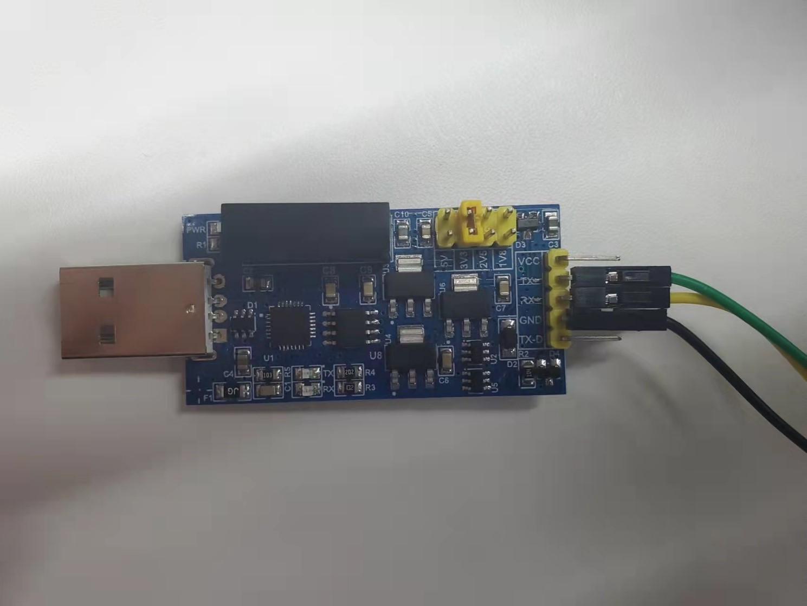

将CP2102的TX引出线连接至EC600N开发板的RX0针脚（编号7），将CP2102的RX引出线连接至开发板的TX0针脚（编号6），将CP2101的GND引出线连接至开发板的GND针脚（编号1）

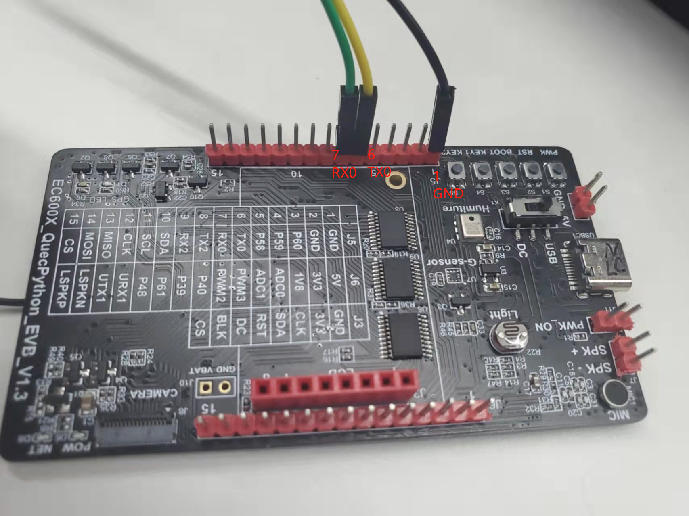

将开发板与CP2102分别连接至电脑的USB口，开发板按下PWK按键开机

### 6.2 获得阿里云连接参数

用户需要在阿里云上注册账户，新建项目，注册设备名称并获得以下参数

设备名称(Devicename)

产品秘钥（ProductKey）

设备秘钥（DeviceSecret）：使用一机一密认证时需要提供的参数，使用一型一密时不存在此参数

产品秘钥（ProductSecret）：使用一型一密认证时需要提供的参数，使用一机一密时不存在此参数

获得阿里云pk/ps


获得DeviceName


### 6.3 编写配置文件

编写配置文件，并将其命名为dtu_config.json

配置文件包含信息如下：

```json
{
  "plate": 1,
  "password": "123",
  "conf": {
    "1": {
      "protocol": "aliyun",
      "type": "mos",
      "keepAlive": "",
      "clientID": "0",
      "Devicename": " ec600n",
      "ProductKey": " gbh26bFEA4M",
      "DeviceSecret": " b7ff5acc0671d40adfd0eff57e7605f6",	
      "ProductSecret": "", 
      "cleanSession": true,
      "qos": "1",
      "subscribe": {"0": " /gbh26bFEA4M/ec600n/user/subtest"}, 
      "publish": {"0": " /gbh26bFEA4M/ec600n/user/pubtest"}, 
      "serialID": "0" 
    }
  },
  "reg": 0,
  "convert": 0,
  "version": 100,
  "nolog": 0,
  "message": {},
  "uconf": { 
    "0": {
      "baudrate": "115200",
      "databits": "8",
      "parity": "0",
      "stopbits": "1",
      "flowctl": "0"
    }
  },
  "fota": 1,
  "pins": [
    "pio1",
    "pio2",
    "pio3"
  ],
  "direction_pin": {},
  "apn": [
    "",
    "",
    ""
  ],
  "service_acquire": 0,
  "work_mode": "through",	
  "auto_connect": 1,
  "offline_storage": false
}

```

### 6.4 烧录代码

#### 6.4.1 连接开发板至电脑，开机，打开QPYCom，选择Qutctel USB MI05 Port端口，并点击连接


#### 6.4.2 切换到下载选项卡，点击"创建项目"，输入项目名称，并点击"确定"

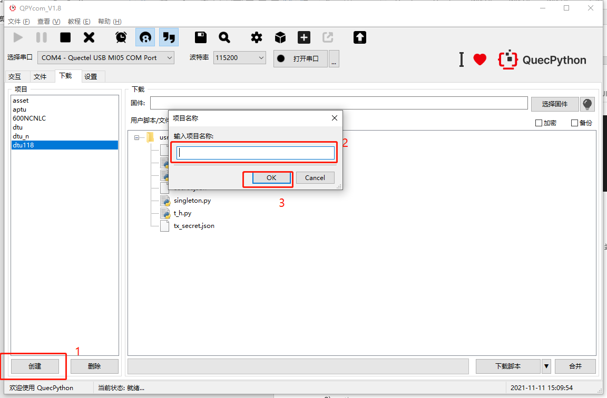

#### 6.4.3 将dtu文件夹内所有内容拖入"用户脚本/文件"框内

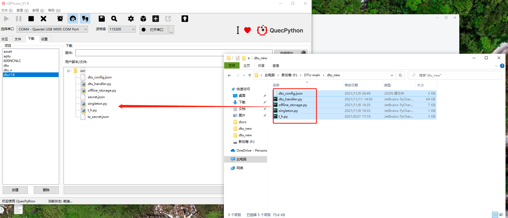

#### 6.4.4 点击"下载脚本"

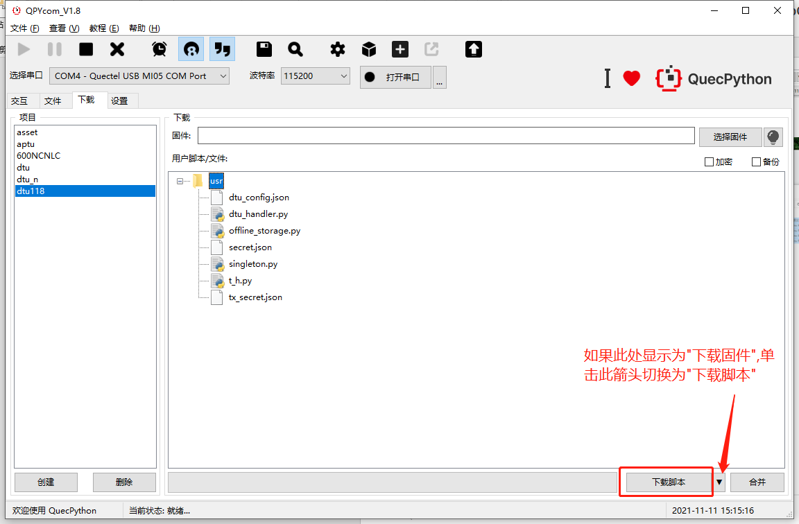

### 6.5 运行

#### 6.5.1 切换至"文件"选项卡，选中"dtu_handler.py"，并点击运行

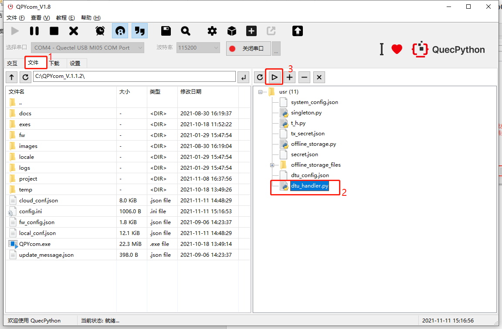

### 6.6 运行结果输出

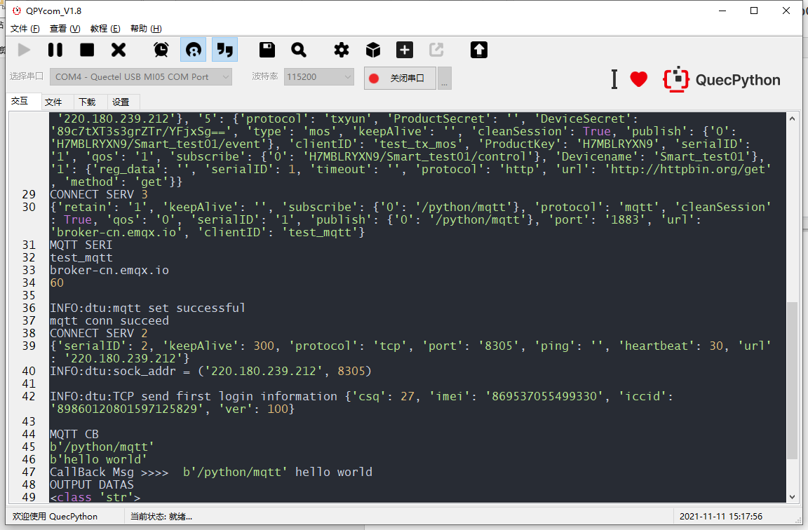

### 6.7 向云端发送消息

#### 6.7.1 打开串口调试工具，选择CP210X USB to UART 连接至CP2102转换板，并打开串口


#### 6.7.2 在uart调试工具中按指定格式传入topic_id, msg_length, crc32值, 需要发送的数据，并点击"发送";


#### 6.7.3 DTU收到数据，并发送至云端


#### 6.7.4 云端接收到的消息

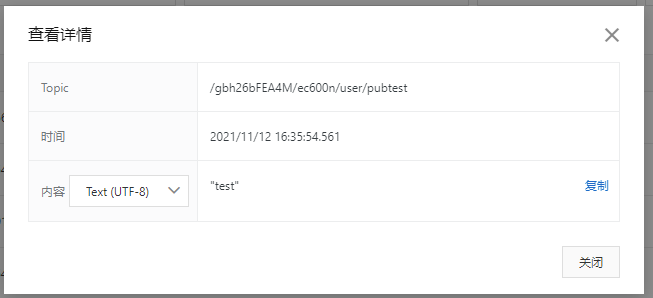

### 6.8 云端向设备发送信息

#### 6.8.1 在阿里云topic列表中向自定义topic发送消息

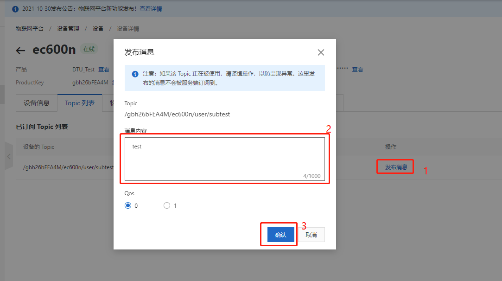

#### 6.8.2 DTU成功收到消息并向串口透传数据


#### 6.8.3 串口收到透传消息

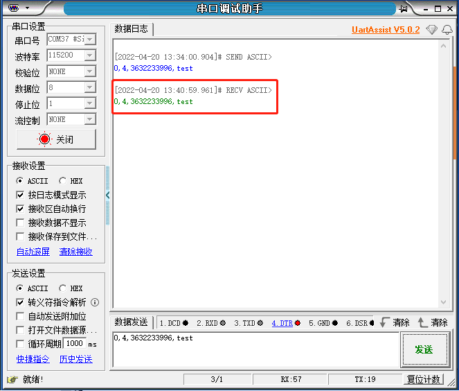

