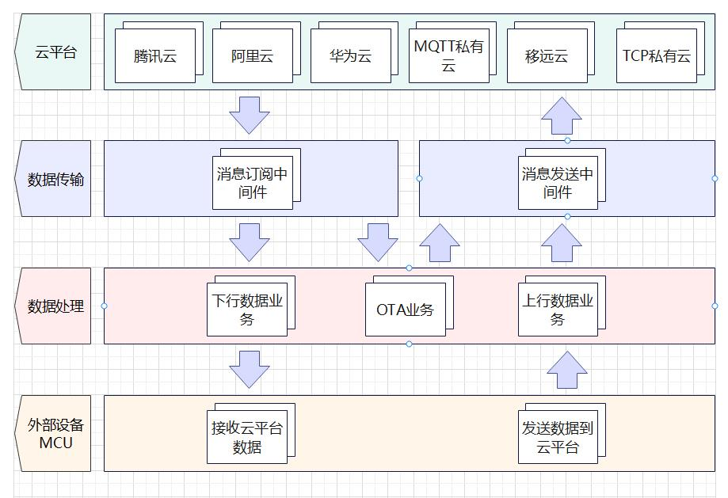

# **DTU公版客户开发手册_V1.1**


## 1. 基本概述

本文档主要基于介绍DTU项目的文件目录及使用接口说明，方便客户快速熟悉DTU方案。

## 2. 项目目录
```
|--code
    |--dtu_config.json
    |--dtu.py
    |--dtu_transaction.py
    |--settings.py
    |--settings_user.py
    |--modules
        |--aliyunIot.py
        |--common.py
        |--history.py
        |--huawei_cloud.py
        |--logging.py
        |--mqttIot.py
        |--quecthing.py
        |--remote.py
        |--socketIot.py
        |--txyunIot.py
        |--serial.py
```

| 文件名         | 说明                                       |
|----------   |-----------------------------------------  |
|`dtu_config.json` | 配置文件，用户配置参数|
|`dtu.py`| dtu主文件，包含dtu的所有初始化逻辑|
|`dtu_transaction.py`| DTU业务逻辑文件，关于DTU的所有业务逻辑都在此文件中|
|`settings.py`| 配置参数读写模块|
|`settings_user.py`| 配置参数默认值，DTU初始化时未找到dtu_config.json文件时，使用此文件中默认配置|
|`modules.aliyunIot.py`| 阿里云模块，主要用于与云端的消息交互与OTA升级|
|`modules.common.py`| 通用接口库|
|`modules.history.py`| 历史文件读写操作模块|
|`modules.huawei_cloud.py`| 华为云模块，主要用于与云端的消息交互|
|`modules.logging.py`| QuecPython log打印接口|
|`modules.mqttIot.py`| MQTT私有云接口，和云端连接通信|
|`modules.quecthing.py`| 移远云模块，主要用于与云端的消息交互与OTA升级|
|`modules.remote.py`| 云端和业务逻辑中间件，将业务和云端接口隔离|
|`modules.socketIot.py`| TCP协议通信模块，主要用于与云端的消息交互|
|`modules.txyunIot.py`| 腾讯云模块，主要用于与云端的消息交互|
|`modules.serial.py`| 串口收发接口|
*注：modules文件夹下为通用接口文件，一般不需要修改*

## 3. 业务API功能说明

### 3.1. `dtu.py`
dtu主文件，包含dtu的所有初始化逻辑。当dtu.py执行时调用
```ptyhon
if __name__ == "__main__":
    dtu = Dtu()
    dtu.start()
```
Dtu类完成初始化，开始DTU业务执行。
#### 3.1.1. Dtu()类
包含所有DTU主要模块的初始化。
**cloud_init**

> 业务功能:
> 
> 完成云初始化，并连接云端服务器

例:

```python
cloud = self.cloud_init(settings.current_settings["system_config"]["cloud"])
```

参数:

| 参数 | 类型 | 说明 |
|---|---|---|
| protocol | str | 云类型名，如`aliyun`|

返回值:

|数据类型|说明|
|:---|---|
|object|云对象|

**start**

> 业务功能:
> 
> 完成DTU所有模块的初始化，开启DTU业务

例:

```python
cloud = self.cloud_init(settings.current_settings["system_config"]["cloud"])
```

参数:

无

返回值:

无

### 3.2. `dtu_transaction.py`

#### 3.2.1. `DownlinkTransaction()`类
DTU数据下行业务，读取云端信息下发给串口。做为执行器注册给remoto pub模块，当云端发送数据时，调用DownlinkTransaction模块去解析。

**add_module**

> 可注册模块:
>
> `Serial`
>
> 业务功能:
> 
> 将串口模块以注册的方式添加进上行数据业务模块

例:

```python
# DownlinkTransaction initialization
down_transaction = DownlinkTransaction()
down_transaction.add_module(serial)
```

参数:

| 参数 | 类型 | 说明 |
|---|---|---|
| module | object | 模块对象 |

返回值:

|数据类型|说明|
|:---|---|
|BOOL|`True`成功, `False`失败|


**__get_sub_topic_id**

> 业务功能:
> 
> 从云参数配置中订阅Topic配置中找到Topic对应的Topic id

例:

```python
# Get mqtt protocol message id
cloud_type = settings.current_settings["system_config"]["cloud"]
if cloud_type in ["aliyun", "txyun", "hwyun", "mqtt_private_cloud"]:
    msg_id = self.__get_sub_topic_id(kwargs.get("topic"))
    if msg_id == None:
        raise Exception("Not found correct topic id")
```

参数:

| 参数 | 类型 | 说明 |
|---|---|---|
| topic | str | 从云端收到的订阅的Topic值 |

返回值:

|数据类型|说明|
|:---|---|
|str|Topic id|


**downlink_main**

> 业务功能:
> 
> 数据下行业务主函数，接收云端数据从串口发出

例:

```python
def __raw_data(self, *args, **kwargs):
    """Handle cloud transparent data transmission."""
    return self.__executor.downlink_main(*args, **kwargs) if self.__executor else False
```

参数:

| 参数 | 类型 | 说明 |
|---|---|---|
| topic | str | 从云端收到的订阅的Topic值 |

返回值:

|数据类型|说明|
|:---|---|
|str|Topic id|

#### 3.2.2. `OtaTransaction()`类
执行OTA业务，配合云模块的OTA接口对模块进行升级。
具体业务逻辑如下：
 1.模块上电将模块名称及版本号上传云端，云端记录此信息。
 2.当模块的名称和版本号存在升级计划，则云端会向模块发送升级计划信息。
 3.模块对升级计划中的版本信息再次检查，确定要升级的版本号与当前模块的版本号不同，则开始下载固件。
 4.固件下载完成开始更新固件，固件更新完成模块进行重启（**此过程需要等待1~2分钟，严禁重启或断电**）

**ota_check**

> 业务功能:
> 
> DTU初始化时调用，向云端发送模块名称和版本号

例:

```python
# Send module release information to cloud. After receiving this information, 
# the cloud server checks whether to upgrade modules
ota_transaction.ota_check()
```

参数:

无

返回值:

无

**event_ota_plain**

> 业务功能:
> 
> - 该模块为`RemoteSubscribe`OTA升级计划信息监听功能
> - 收到被监听者的消息通知时，进行处理
> - 检测设备是否开启OTA升级，否则取消OTA升级
> - 调用`Controller.remote_ota_action`功能进行OTA升级

例:

```python
def __ota_plain(self, *args, **kwargs):
    """Handle cloud OTA plain"""
    return self.__ota_executor.event_ota_plain(*args, **kwargs) if self.__ota_executor else False
```

参数:

无

返回值:

无

#### 3.2.3. `UplinkTransaction()`类
DTU数据上行业务，读取串口信息上传给云端。

**__get_pub_topic_id_list**

> 业务功能:
> 
> - 从云配置中获取发布Topic id列表

例:

```python
pub_topic_id_list = self.__get_pub_topic_id_list()
```

参数:

无

返回值:

|数据类型|说明|
|:---|---|
|list|发布Topic id列表|

**__parse**

> 业务功能:
> 
> - 当和云端通信采用MQTT协议时，解析串口数据（和云端通信协议不同时，模块的串口协议也不同）
> - 本函数可递归，当串口数据流中包含不止一帧完整数据时，会递归继续调用解析。

例:

```python
self.__parse_data += data
self.__send_to_cloud_data = []
self.__parse()
```

参数:

无

返回值:

无

**__uplink_data**

> 业务功能:
> 
> - 将从串口读取的数据解析并发送
> - 当和云端通信采用MQTT协议时，发送数据给云端时会创建新线程执行发送过程（串口数据可能包含多帧MQTT协议，时间花费比较长，可能会造成串口数据读取延迟，故单独创建线程执行）。

例:

```python
def uplink_main(self):
    """Read serial data, parse and upload to the cloud
    """
    while 1:
        # Read uart data
        read_byte = self.__serial.read(nbytes=1024, timeout=100)
        if read_byte:
            try:
                self.__uplink_data(read_byte)
            except Exception as e:
                usys.print_exception(e)
                log.error("Parse uart data error: %s" % e)
```

参数:

| 参数 | 类型 | 说明 |
|---|---|---|
| topic | str | 从云端收到的订阅的Topic值 |

返回值:

无

**__post_history_data**

> 业务功能:
> 
> - 将历史数据发送给云端

例:

```python
if hist["data"]:
    pt_count = 0
    for i, data in enumerate(hist["data"]):
        pt_count += 1
        if not self.__post_history_data(data):
            res = False
            break

    hist["data"] = hist["data"][pt_count:]
    if hist["data"]:
        # Flush data in hist-dictionary to tracker_data.hist file.
        self.__history.write(hist["data"])
```

参数:

无

返回值:

无

**uplink_main**

> 业务功能:
> 
> - 数据上行业务主函数，读取串口数据解析后上传云端

例:

```python
 # Start uplink transaction
    try:
        _thread.start_new_thread(up_transaction.uplink_main, ())
    except:
        raise self.Error(self.error_map[self.ErrCode.ESYS])
```

参数:

无

返回值:

无

### 3.3. `settings.py`

#### 3.3.1. `Settings()`类

**settings 导入**

例:

```python
from usr.settings import settings
```

**init**

> 功能:
> 
> - 检查持久化配置文件（dtu_config.json）是否存在，存在则直接读取配置文件配置
> - 若不存在则读取`SYSConfig`设置参数, 根据配置读取用户配置与功能配置
> - 读取完成所有配置参数后，将配置参数写入配置文件中持久化存储

例:

```python
res = settings.init()
```

参数:

无

返回值:

|数据类型|说明|
|:---|---|
|BOOL|`True`成功, `False`失败|

**get**

例:

```python
current_settings = settings.get()
```

参数:

无

返回值:

|数据类型|说明|
|:---|---|
|DICT|配置参数|

#### save 持久化保存配置参数

> 将配置参数写入文件进行持久化保存，文件名全路径`/usr/dtu_config.json`

例:

```python
res = settings.save()
```

参数:

无

返回值:

|数据类型|说明|
|:---|---|
|BOOL|`True`成功, `False`失败|

#### remove 删除配置参数文件

例:

```python
res = settings.remove()
```

参数:

无

返回值:

|数据类型|说明|
|:---|---|
|BOOL|`True`成功, `False`失败|

#### reset 重置配置参数

> 先移除配置参数文件, 再重新生成配置参数文件

例:

```python
res = settings.reset()
```

参数:

无

返回值:

|数据类型|说明|
|:---|---|
|BOOL|`True`成功, `False`失败|

### 3.4. `settings_user.py`

#### 3.3.1. `UserConfig()`类
包含dtu_config.json中所有的配置项，当初始化配置参数时，如果没有找到dtu_config.json时则获取UserConfig类中元素的赋值。

## 4. 业务流程框架图

### 4.1 DTU功能框架图


### 4.2 OTA升级流程图

`上图为阿里云OTA升级流程，由于移远云创建升级计划后不会主动向模块发送升级计划，模块需要增加周期性请求OTA升级计划。`