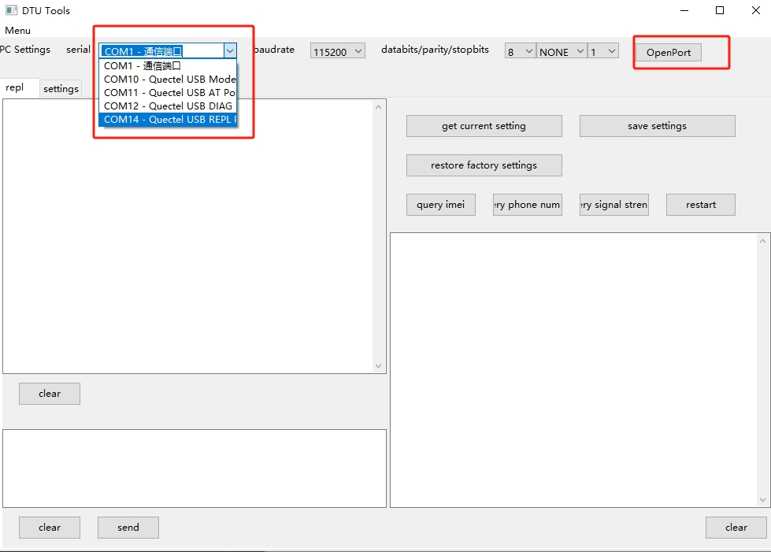
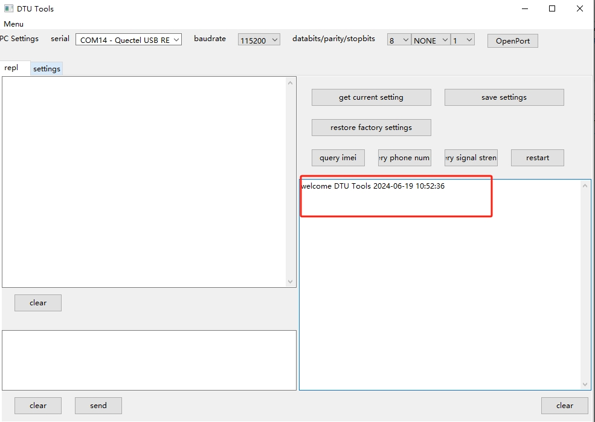
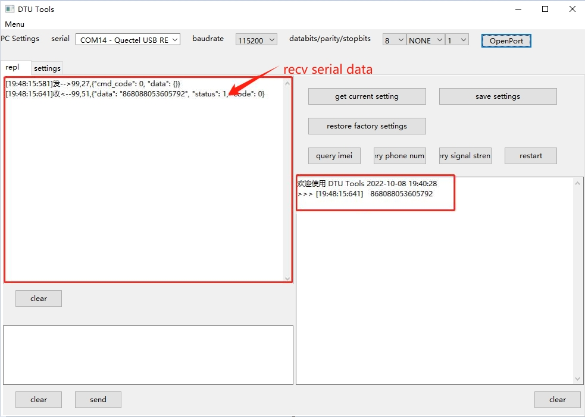
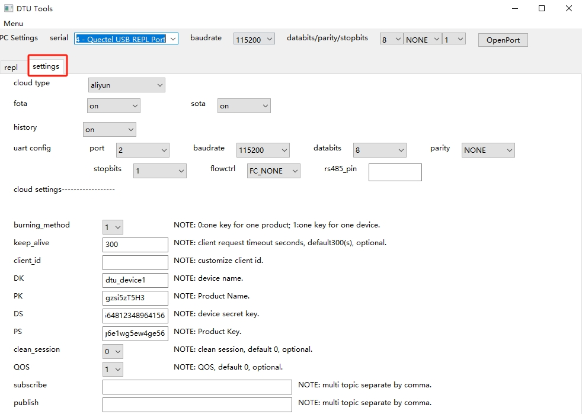
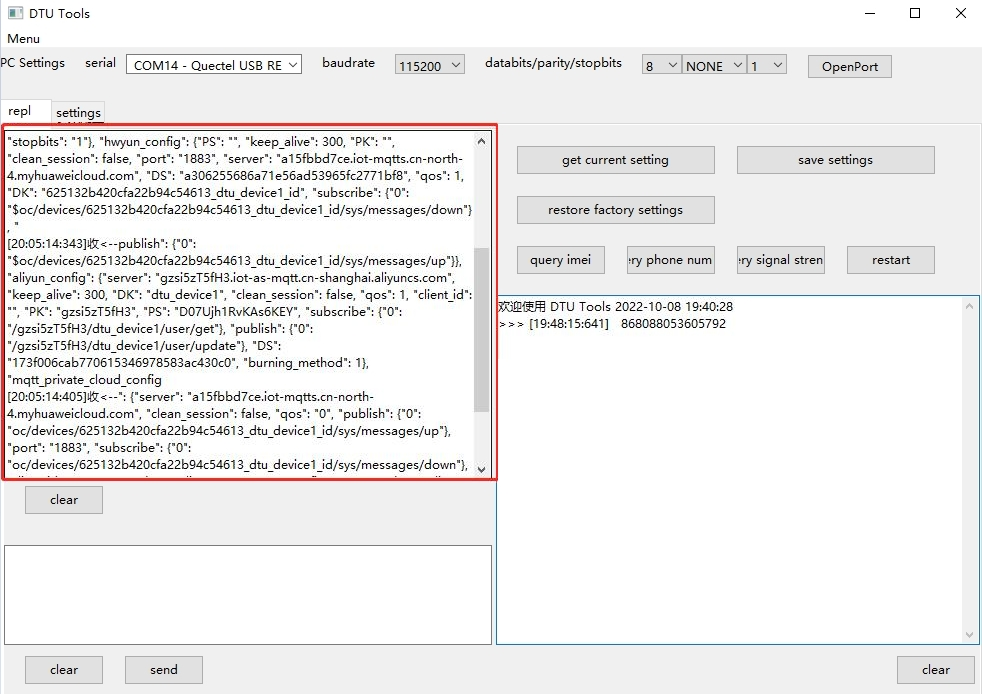
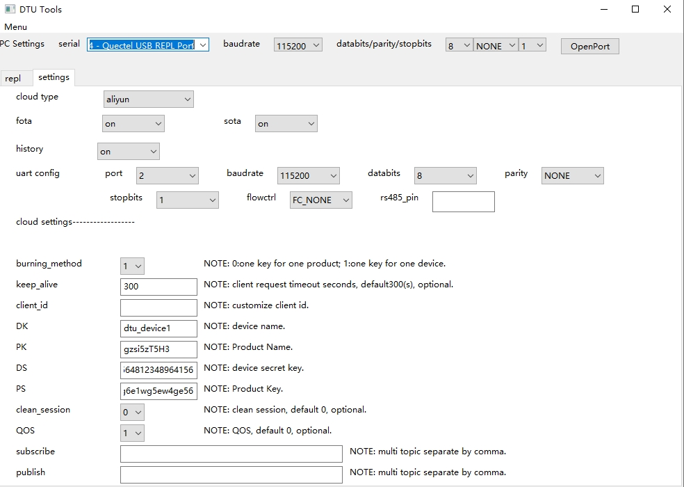
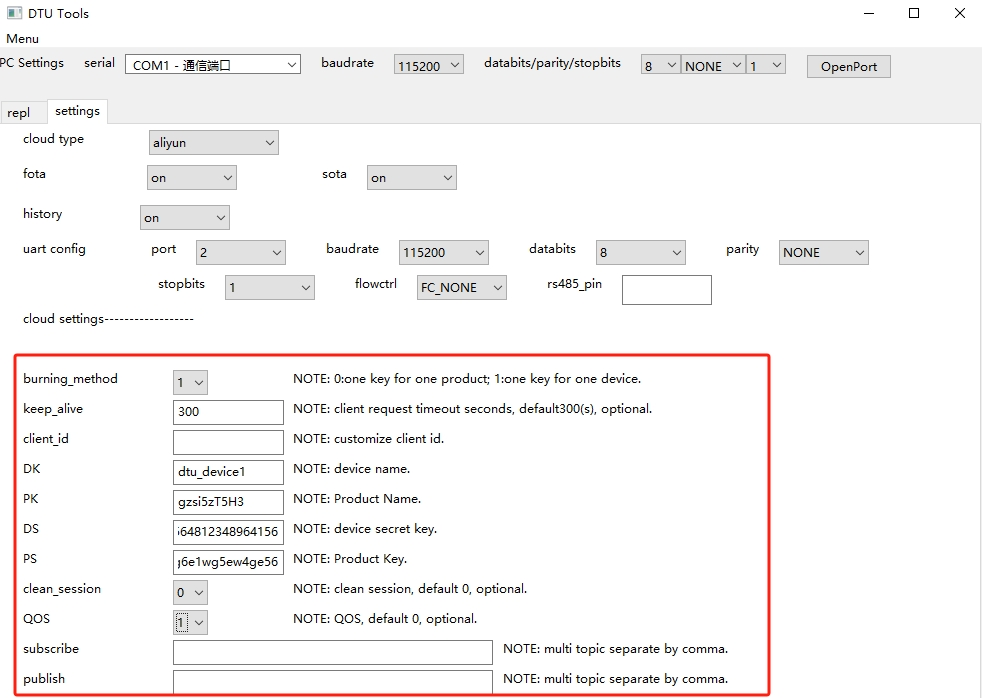
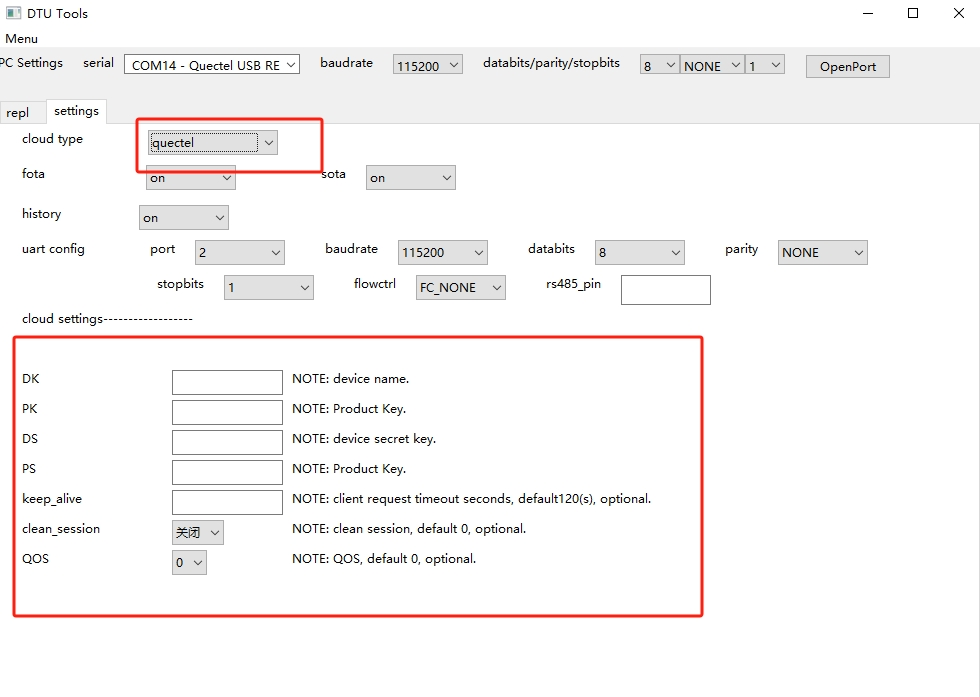
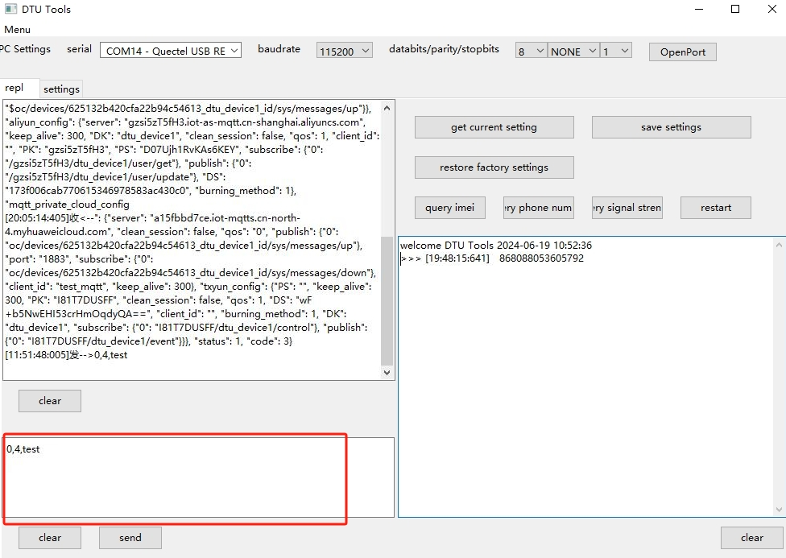

# DTU GUI Tool User Guide

## 1. Overview

This document mainly introduces the use of the DTU GUI tool.

The DTU GUI tool is currently mainly used for customer development and debugging. It provides basic query and setting functions, as well as simulating MCU testing and DTU module data transmission and reception. Users can use a USB to TTL module to connect the PC and the DTU.

The DTU GUI is developed based on wxPython. The currently compiled `dtu_gui.exe` only supports Windows systems. Users on Linux/macOS can configure the Python environment, install the wxPython library, and directly run `dtu_gui.py` or compile the corresponding version of the executable program themselves.

## 2. Running the DTU GUI Tool

**Double-click to open the DTU GUI tool**

**Open the serial port**

## 3. DTU GUI Function Introduction

## 3.1 Toolbox

**The current functions of the toolbox are as follows:**
| **Button Name** | **Function** |
| --------------- | ------------ |
| **Get Current Parameters** | Get the current configuration parameters of the DTU and jump to the `Parameter Configuration` interface to display specific parameters |
| **Save All Settings and Restart** | Write the current configuration parameters in the `Parameter Configuration` interface to the DTU and restart the DTU |
| **Restore Factory Settings and Restart** | Delete all configuration parameters, restore factory settings, and restart the DTU |
| **Query IMEI Number** | Get the IMEI number of the DTU module |
| **Query Local Number** | Get the phone number of the SIM card in the DTU |
| **Query Signal Strength** | Get the CSQ signal strength, with a range of 0 ~ 31, where the larger the value, the stronger the signal strength |
| **Device Restart** | Restart the DTU device |

### 3.1.1 Query IMEI Number:

- Query IMEI number:

The detailed serial port data is displayed in the string format in the left serial port data display box, and the obtained IMEI number is displayed in the command message box on the right.

### 3.1.2 Get Current Configuration Parameters of DTU:

Click the `Get Current Parameters` button to immediately jump to the parameter configuration interface.

Click the interactive interface to see the specific serial port information interaction between the tool and the DTU.

## 3.3 Import Configuration Parameters
After reading the current configuration parameters, enter the parameter configuration interface. You can modify the configuration according to actual needs (you can also fill in the configuration directly without reading it).
### 3.3.1 Basic Parameter Configuration

The basic configuration parameters are as shown in the figure above:
| **Parameter Name** | **Meaning** |
| ------------------ | ----------- |
| Cloud Platform Channel Type | Cloud platform selection, options: `Aliyun`, `Tencent Cloud`, `Huawei Cloud`, `Quectel Cloud`, `TCP Private Cloud`, `MQTT Private Cloud`|
| Firmware Upgrade | Whether to enable firmware OTA upgrade |
| Script Upgrade | Whether to enable project script OTA upgrade |
| Historical Data Storage | When communication is abnormal and the DTU cannot send data to the cloud, the data to be sent is saved and resent after communication is restored |
| Serial Port Number | External MCU connection DTU serial port number, options: `0`, `1`, `2` |
| Baud Rate | Serial port baud rate |
| Data Bits | Parity check |
| Stop Bits | Stop bit length, options: `1`, `2` |
| Flow Control | Hardware control flow, options: `FC_NONE`, `FC_HW` |
| Control 485 Communication Direction Pin | Pull up and down the specified GPIO before and after sending data through the serial port to indicate the direction of 485 communication. For example, `1`, `2` represent `UART.GPIO1`, `UART.GPIO2`.

### 3.3.2 Cloud Parameter Configuration
The cloud parameter configuration items will change according to the value selected in the basic `Cloud Platform Communication Type`. When the `Cloud Platform Communication Type` is Aliyun, the cloud parameter configuration items are as follows:

When the `Cloud Platform Communication Type` is Quectel Cloud, the cloud parameter configuration items are as follows:

## 3.4 Data Sending Frame Format Requirements
The data sending format is consistent with the communication format between the MCU and the DTU. Depending on the different communication protocols with the cloud, the communication protocol between the module and the external device (such as the MCU) will also be different. When the module communicates with the cloud using the TCP protocol, since both TCP and the serial port are in the form of data streams, the data is directly transmitted without any processing; when the module communicates with the cloud using the MQTT protocol, to distinguish different data frames, the module's external serial port protocol uses a simple data frame:
`<topic_id>,<msg_len>,<msg_data>"`.
**Note: Quectel Cloud does not support Topic settings, `<topic_id>` is uniformly `"0"`**

**Example Messages:**

- Uplink Message:

`“1,6,abcedf”`

- Downlink Message:

`“1,6,ijklmn”`

The uplink and downlink messages between the module and the external device (MCU) are in string format, and the data items are separated by `,`.
