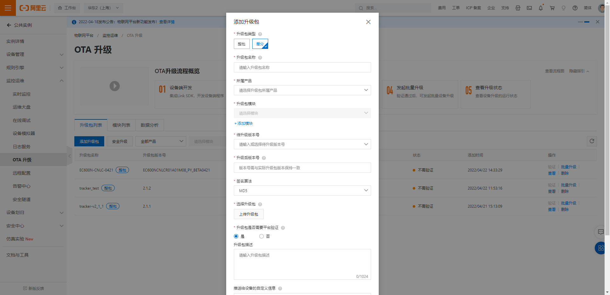
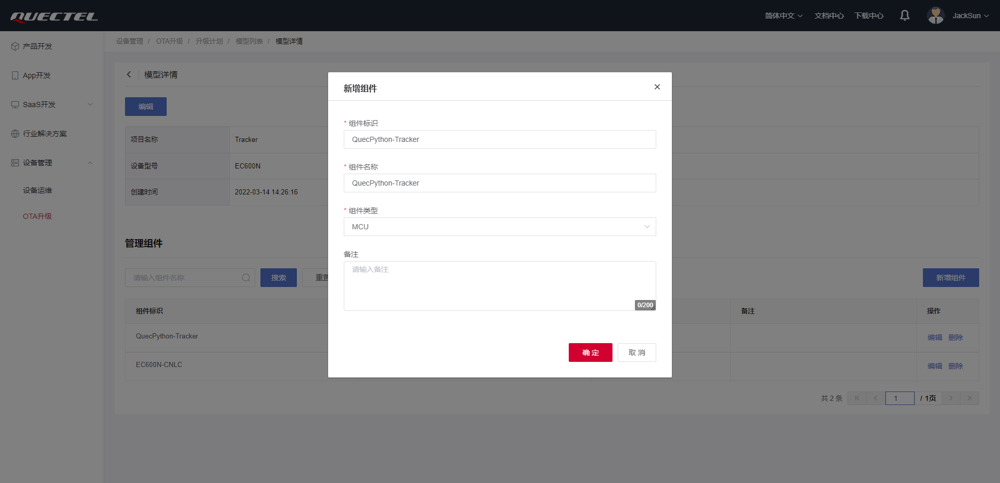

# DTU OTA Upgrade User Guide

## OTA Upgrade

> **Firmware upgrades only support differential upgrades, not full package upgrades**

### Aliyun

> **Project file upgrade package: create the upgrade package by changing the file extension of the project code file to `.bin`, upload it to the cloud, and multiple files can be uploaded**

#### Firmware Upgrade

1. Create a differential firmware upgrade package (contact firmware developers);
2. Create an OTA module, named after the device platform name, e.g., `EC600N-CNLC`.

3. Create an OTA upgrade package

4. Select batch upgrade, create an upgrade plan

5. Wait for the device to upgrade and check the upgrade results

    + If the device has OTA upgrade and automatic OTA upgrade enabled, wait for the device to complete the upgrade and check the upgrade results;
    + If the device has OTA upgrade enabled but automatic upgrade is not enabled, you can issue the `user_ota_action=1` model setting command through the online debugging module to perform the OTA upgrade.

#### Project Upgrade

1. Create an OTA module, named after `PROJECT_NAME` in `settings.py`, e.g., `QuecPython-Tracker`.

2. Change the file extension of the project files to `.bin`
3. Create an OTA upgrade package
    + In the **Custom Information Pushed to Device** section, write the upgrade file name corresponding to the full path file name on the device, e.g., `{"files":{"common.bin":"/usr/modules/common.py","settings.bin":"/usr/settings.py","test_tracker.bin":"/usr/test_tracker.py"}}`

4. Select batch upgrade, create an upgrade plan

5. Wait for the device to upgrade and check the upgrade results

    + If the device has OTA upgrade and automatic OTA upgrade enabled, wait for the device to complete the upgrade and check the upgrade results;
    + If the device has OTA upgrade enabled but automatic upgrade is not enabled, you can issue the `user_ota_action=1` model setting command through the online debugging module to perform the OTA upgrade.

### Quectel Cloud

> **For project file upgrade packages, it is recommended to package multiple project files into a compressed file and upload it to the cloud**

#### Firmware Upgrade

1. Create a differential firmware upgrade package (contact firmware developers);
2. Create an OTA upgrade model, add firmware components, and MCU components (for project upgrades)
    + The identifier of the firmware type component is named after the device platform name, e.g., `EC600N-CNLC`.
    + The identifier of the MCU type component is named after `PROJECT_NAME` in `settings.py`, e.g., `QuecPython-Tracker`.

3. Create a firmware version upgrade package

4. Create a firmware upgrade plan

5. Wait for the device to upgrade and check the upgrade results

    + If the device has OTA upgrade and automatic OTA upgrade enabled, wait for the device to complete the upgrade and check the upgrade results;
    + If the device has OTA upgrade enabled but automatic upgrade is not enabled, you can issue the `user_ota_action=1` model setting command through the online debugging module to perform the OTA upgrade.

#### Project Upgrade

1. Package the project files into a compressed file, packaging command: `tar -zcvf sotaFile.tar.gz *.py`;
2. Create an OTA upgrade model, add firmware components, and MCU components (for project upgrades)
    + The identifier of the firmware type component is named after the device platform name, e.g., `EC600N-CNLC`.
    + The identifier of the MCU type component is named after `PROJECT_NAME` in `settings.py`, e.g., `QuecPython-Tracker`.

3. If MCU components were not created when creating the OTA model, they can be added in the model

4. Create a project version upgrade package

4. Create a project upgrade plan

5. Wait for the device to upgrade and check the upgrade results

    + If the device has OTA upgrade and automatic OTA upgrade enabled, wait for the device to complete the upgrade and check the upgrade results;
    + If the device has OTA upgrade enabled but automatic upgrade is not enabled, you can issue the `user_ota_action=1` model setting command through the online debugging module to perform the OTA upgrade.

