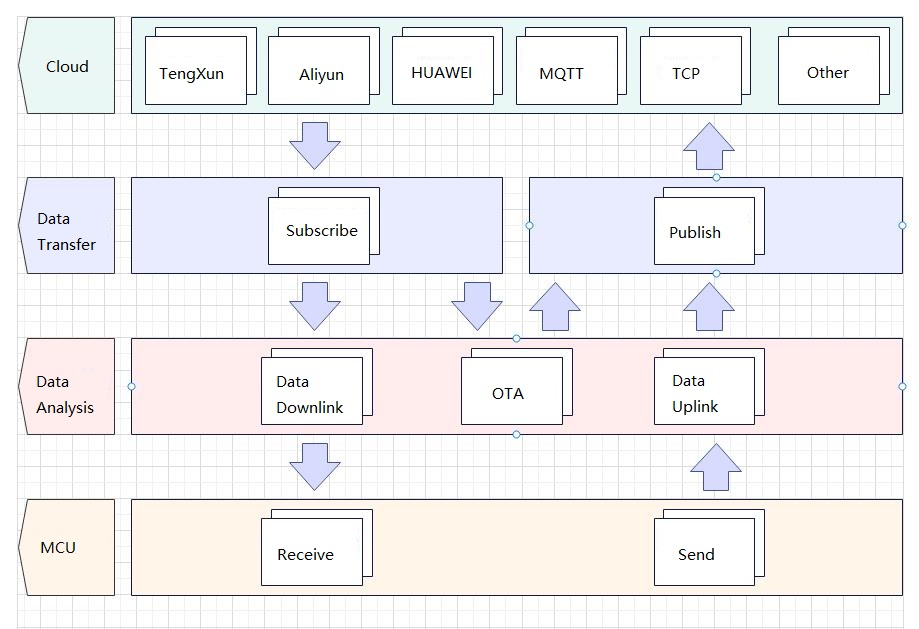
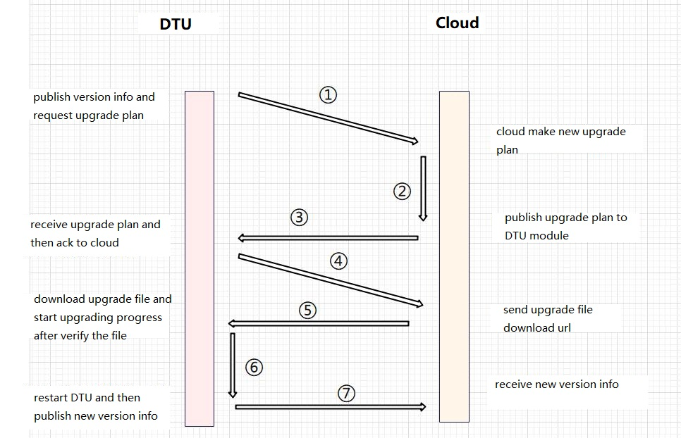

# DTU Solution Development Guide

## 1. Overview

This document primarily introduces the file directory and interface usage instructions of the DTU project, facilitating customers to quickly familiarize themselves with the DTU scheme.

## 2. Project Directory
```
|--code
    |--dtu_config.json
    |--dtu.py
    |--dtu_transaction.py
    |--settings.py
    |--settings_user.py
    |--modules
        |--aliyunIot.py
        |--common.py
        |--history.py
        |--huawei_cloud.py
        |--logging.py
        |--mqttIot.py
        |--quecthing.py
        |--remote.py
        |--socketIot.py
        |--txyunIot.py
        |--serial.py
```

| Filename         | Description                                       |
|----------   |-----------------------------------------  |
|`dtu_config.json` | Configuration file, user configuration parameters|
|`dtu.py`| Main DTU file, contains all initialization logic for DTU|
|`dtu_transaction.py`| DTU business logic file, all business logic related to DTU is in this file|
|`settings.py`| Configuration parameter read/write module|
|`settings_user.py`| Default configuration parameters, used when the DTU initialization does not find the dtu_config.json file|
|`modules.aliyunIot.py`| Aliyun module, mainly used for message interaction with the cloud and OTA upgrades|
|`modules.common.py`| General interface library|
|`modules.history.py`| Historical file read/write operation module|
|`modules.huawei_cloud.py`| Huawei Cloud module, mainly used for message interaction with the cloud|
|`modules.logging.py`| QuecPython log printing interface|
|`modules.mqttIot.py`| MQTT private cloud interface, for communication with the cloud|
|`modules.quecthing.py`| Quectel Cloud module, mainly used for message interaction with the cloud and OTA upgrades|
|`modules.remote.py`| Middleware between cloud and business logic, isolates business and cloud interfaces|
|`modules.socketIot.py`| TCP protocol communication module, mainly used for message interaction with the cloud|
|`modules.txyunIot.py`| Tencent Cloud module, mainly used for message interaction with the cloud|
|`modules.serial.py`| Serial communication interface|
*Note: The files under the modules folder are general interface files and usually do not need modification.*

## 3. Business API Function Description

### 3.1. `dtu.py`
The main DTU file, contains all initialization logic for DTU. When `dtu.py` is executed, it calls:
```python
if __name__ == "__main__":
    dtu = Dtu()
    dtu.start()
```
The `Dtu` class completes initialization and starts DTU business execution.
#### 3.1.1. `Dtu` Class
Contains the initialization of all main DTU modules.
**cloud_init**

> Business Function:
> 
> Completes cloud initialization and connects to the cloud server.

Example:

```python
cloud = self.cloud_init(settings.current_settings["system_config"]["cloud"])
```

Parameters:

| Parameter | Type | Description |
|---|---|---|
| protocol | str | Cloud type name, such as `aliyun`|

Return Value:

|Data Type|Description|
|:---|---|
|object|Cloud object|

**start**

> Business Function:
> 
> Completes the initialization of all DTU modules and starts DTU business.

Example:

```python
cloud = self.cloud_init(settings.current_settings["system_config"]["cloud"])
```

Parameters:

None

Return Value:

None

### 3.2. `dtu_transaction.py`

#### 3.2.1. `DownlinkTransaction` Class
DTU data downlink business, reads cloud information and sends it to the serial port. Registered as an actuator to the remote pub module, when the cloud sends data, it calls the `DownlinkTransaction` module for parsing.

**add_module**

> Registrable Module:
>
> `Serial`
>
> Business Function:
> 
> Adds the serial module to the upstream data business module in a registered manner.

Example:

```python
# DownlinkTransaction initialization
down_transaction = DownlinkTransaction()
down_transaction.add_module(serial)
```

Parameters:

| Parameter | Type | Description |
|---|---|---|
| module | object | Module object |

Return Value:

|Data Type|Description|
|:---|---|
|BOOL|`True` success, `False` failure|


**__get_sub_topic_id**

> Business Function:
> 
> Subscribes to the Topic configuration from the cloud parameter configuration to find the Topic corresponding to the Topic id.

Example:

```python
# Get mqtt protocol message id
cloud_type = settings.current_settings["system_config"]["cloud"]
if cloud_type in ["aliyun", "txyun", "hwyun", "mqtt_private_cloud"]:
    msg_id = self.__get_sub_topic_id(kwargs.get("topic"))
    if msg_id == None:
        raise Exception("Not found correct topic id")
```

Parameters:

| Parameter | Type | Description |
|---|---|---|
| topic | str | Subscribed Topic value received from the cloud |

Return Value:

|Data Type|Description|
|:---|---|
|str|Topic id|


**downlink_main**

> Business Function:
> 
> Main function for data downlink business, receives cloud data and sends it from the serial port.

Example:

```python
def __raw_data(self, *args, **kwargs):
    """Handle cloud transparent data transmission."""
    return self.__executor.downlink_main(*args, **kwargs) if self.__executor else False
```

Parameters:

| Parameter | Type | Description |
|---|---|---|
| topic | str | Subscribed Topic value received from the cloud |

Return Value:

|Data Type|Description|
|:---|---|
|str|Topic id|

#### 3.2.2. `OtaTransaction` Class
Executes OTA business, cooperates with the cloud module's OTA interface to upgrade the module.
Specific business logic is as follows:
 1. The module powers on and uploads the module name and version number to the cloud, and the cloud records this information.
 2. When the module name and version number have an upgrade plan, the cloud sends the upgrade plan information to the module.
 3. The module checks the version information in the upgrade plan again. If the version number to be upgraded is different from the current module version number, it starts downloading the firmware.
 4. After the firmware download is complete, it starts updating the firmware. After the firmware update is complete, the module restarts (**This process takes 1-2 minutes, do not reboot or power off**).

**ota_check**

> Business Function:
> 
> Called during DTU initialization, sends the module name and version number to the cloud.

Example:

```python
# Send module release information to cloud. After receiving this information, 
# the cloud server checks whether to upgrade modules
ota_transaction.ota_check()
```

Parameters:

None

Return Value:

None

**event_ota_plain**

> Business Function:
> 
> - This module is the `RemoteSubscribe` OTA upgrade plan information listener function.
> - When a notification message is received from the listener, it processes it.
> - Checks whether the device has enabled OTA upgrades, otherwise cancels the OTA upgrade.
> - Calls the `Controller.remote_ota_action` function to perform the OTA upgrade.

Example:

```python
def __ota_plain(self, *args, **kwargs):
    """Handle cloud OTA plain"""
    return self.__ota_executor.event_ota_plain(*args, **kwargs) if self.__ota_executor else False
```

Parameters:

None

Return Value:

None

#### 3.2.3. `UplinkTransaction` Class
DTU data uplink business, reads serial port information and uploads it to the cloud.

**__get_pub_topic_id_list**

> Business Function:
> 
> - Gets the list of publish Topic ids from the cloud configuration.

Example:

```python
pub_topic_id_list = self.__get_pub_topic_id_list()
```

Parameters:

None

Return Value:

|Data Type|Description|
|:---|---|
|list|List of publish Topic ids|

**__parse**

> Business Function:
> 
> - When communicating with the cloud using the MQTT protocol, parses the serial data (when the communication protocol with the cloud is different, the serial protocol of the module is also different).
> - This function can be recursive. When the serial data stream contains more than one complete frame of data, it will recursively continue to call the parsing.

Example:

```python
self.__parse_data += data
self.__send_to_cloud_data = []
self.__parse()
```

Parameters:

None

Return Value:

None

**__uplink_data**

> Business Function:
> 
> - Parses and sends the data read from the serial port.
> - When communicating with the cloud using the MQTT protocol, a new thread is created to execute the sending process when sending data to the cloud (the serial data may contain multiple frames of MQTT protocol, which takes a long time and may cause serial data read delay, so a separate thread is created to execute it).

Example:

```python
def uplink_main(self):
    """Read serial data, parse and upload to the cloud
    """
    while 1:
        # Read uart data
        read_byte = self.__serial.read(nbytes=1024, timeout=100)
        if read_byte:
            try:
                self.__uplink_data(read_byte)
            except Exception as e:
                usys.print_exception(e)
                log.error("Parse uart data error: %s" % e)
```

Parameters:

| Parameter | Type | Description |
|---|---|---|
| topic | str | Subscribed Topic value received from the cloud |

Return Value:

None

**__post_history_data**

> Business Function:
> 
> - Sends historical data to the cloud.

Example:

```python
if hist["data"]:
    pt_count = 0
    for i, data in enumerate(hist["data"]):
        pt_count += 1
        if not self.__post_history_data(data):
            res = False
            break

    hist["data"] = hist["data"][pt_count:]
    if hist["data"]:
        # Flush data in hist-dictionary to tracker_data.hist file.
        self.__history.write(hist["data"])
```

Parameters:

None

Return Value:

None

**uplink_main**

> Business Function:
> 
> - Main function for data uplink business, reads serial port data, parses it, and uploads it to the cloud.

Example:

```python
 # Start uplink transaction
    try:
        _thread.start_new_thread(up_transaction.uplink_main, ())
    except:
        raise self.Error(self.error_map[self.ErrCode.ESYS])
```

Parameters:

None

Return Value:

None

### 3.3. `settings.py`

#### 3.3.1. `Settings` Class

**settings Import**

Example:

```python
from usr.settings import settings
```

**init**

> Function:
> 
> - Checks if the persistent configuration file (dtu_config.json) exists. If it exists, it directly reads the configuration file.
> - If it does not exist, it reads the `SYSConfig` settings parameters, reads user configuration and function configuration based on the configuration.
> - After reading all configuration parameters, it writes the configuration parameters to the configuration file for persistent storage.

Example:

```python
res = settings.init()
```

Parameters:

None

Return Value:

|Data Type|Description|
|:---|---|
|BOOL|`True` success, `False` failure|

**get**

Example:

```python
current_settings = settings.get()
```

Parameters:

None

Return Value:

|Data Type|Description|
|:---|---|
|DICT|Configuration parameters|

#### save Persistent save configuration parameters

> Writes the configuration parameters to the file for persistent storage, with the full path of the file name `/usr/dtu_config.json`.

Example:

```python
res = settings.save()
```

Parameters:

None

Return Value:

|Data Type|Description|
|:---|---|
|BOOL|`True` success, `False` failure|

#### remove Delete configuration parameter file

Example:

```python
res = settings.remove()
```

Parameters:

None

Return Value:

|Data Type|Description|
|:---|---|
|BOOL|`True` success, `False` failure|

#### reset Reset configuration parameters

> First removes the configuration parameter file, then regenerates the configuration parameter file.

Example:

```python
res = settings.reset()
```

Parameters:

None

Return Value:

|Data Type|Description|
|:---|---|
|BOOL|`True` success, `False` failure|

### 3.4. `settings_user.py`

#### 3.3.1. `UserConfig` Class
Contains all configuration items in dtu_config.json. When initializing configuration parameters, if the dtu_config.json is not found, the values of the elements in the `UserConfig` class are used.

## 4. Business Process Framework Diagram

### 4.1 DTU Function Framework Diagram


### 4.2 OTA Upgrade Flow Diagram

`The above diagram is the Aliyun OTA upgrade process. Since Quectel Cloud does not actively send upgrade plans to the module after creating the upgrade plan, the module needs to periodically request the OTA upgrade plan.`