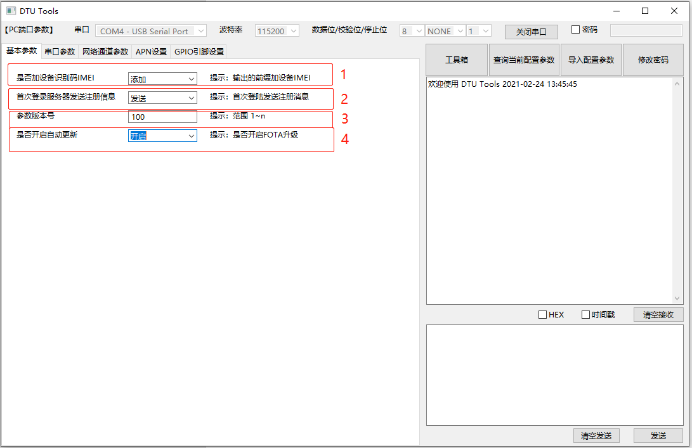
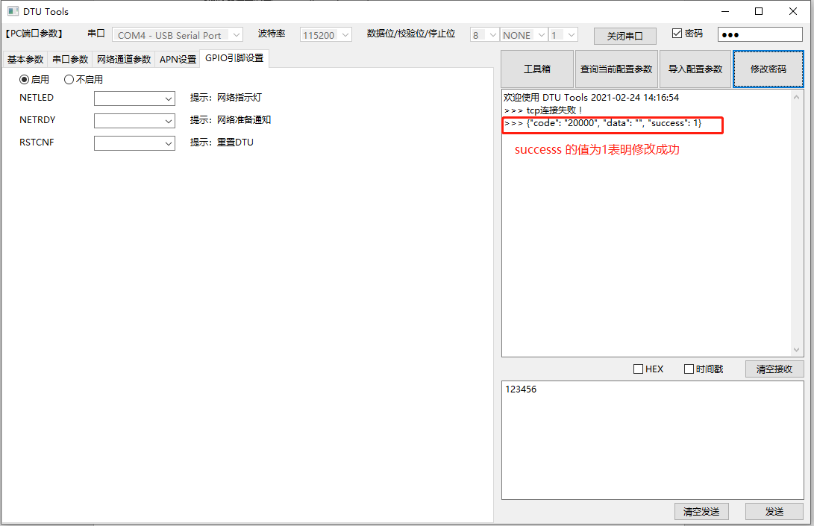

# **DTU GUI工具使用说明**

## 1.基本概述

本文档主要介绍DTU GUI工具的使用。

DTU GUI工具现阶段主要为客户开发调试使用，DTU GUI工具提供基础的查询与设置功能，
用户可使用USB to TTL模块连接PC与DTU。

DTU GUI基于wxPython开发，现阶段已编译的dtu_gui.exe仅支持Windows系统，
用户在Linux/macOS配置Python环境并安装wxPython lib后可直接运行dtu_gui.py或自行编译对应版本的exe程序。

## 2. 运行DTU GUI 工具

**双击打开DTU GUI工具**

运行后的DTU GUI的工具

**打开串口**

## 3. DTU GUI 功能介绍

## 3.1工具箱

**目前工具箱的查询功能如下：**

- 查询IMEI号
- 查询本机号码
- 查询版本号
- 查询信号强度
- 诊断查询
- 查询ICCID
- 查询ADC电压
- 查询GPIO信息
- 查询电池电压
- 查询温湿度
- 查询网络连接状态
- 查询基站状态
- 基站定位

### 示例:

查询IMEI号：

返回的数据: 
`【2021-11-24 20:35:39】 869537055499330`

## 3.2查询当前配置参数

**操作步骤如下图：**

**以上步骤操作完再点击查询当前配置参数**

## 3.3导入配置参数

### 3.3.1基本参数配置

**如上图的数字编号：**

1. **是否加设备识别码IMEI就是在返回的数据前面加IMEI号。**

`864430010001091{"code": "20000", "data": "864430010001091", "success": 1}`

如果不加IMEI号码：

`{"code": "20000", "data": "864430010001091", "success": 1}`

2. **首次登录服务器发送注册消息**

开启之后会在成功登录tcp/udp服务器发送注册消息，默认发送的注册消息如下的格式所示：

`{"csq": "25", "imei": "864430010001091", "iccid": "898600F21274F6605263", "ver":"100"}`  

如果在tcp/udp的配置参数中自定义了首次登录服务器发送的注册消息，则会发送用户自定义的。

具体tcp/udp的参数配置后面会有详细的介绍

3. **固件版本号**

数值的范围是 &gt; 0

4. **是否开启自动更新**

打开自动更新会在DTU启动的时候去OTA Cloud查看是否有需要更新的固件包，如果有更新的任务就会下载固件包，校验固件包。校验通过开始更新，更新完毕会重启DTU固件。

建议：开启自动更新前可以根据需要手动备份之前的配置文件。暂时不支持自动备份的功能

### 3.3.2串口参数

有三个串口参数配置，每个串口配置的参数有：波特率，数据位，校验位，停止位

目前不支持串口参数的配置功能，此项配置功能后续上线

### 3.3.3网络参数配置

打开任意通道的"开启"按钮，则会将七个通道的数据导入到配置文件，由于其他的通道参数没有配置会导入空的配置参数到配置文件，因此点击"开启"按钮就需要按照需求将所以的通道配置参数都设置一下

#### 3.3.3.1 通道类型：HTTP

| **字段** | **type** | **Required** | **含义** |
| --- | --- | --- | --- |
| method | Str | true | 提交请求的方法 |
| url | str | true | HTTP请求的地址和参数 |
| data | json | false | post请求填写，get请求不填写 |
| timeout | int | false | HTTP请求最长等待时间 |
| serialD | int | true | HTTP绑定的串口号（1~2） |

提示：其中serialD的绑定串口号的功能暂未上线，后期会和串口配置功能一同上线，下同

#### 3.3.3.2 通道类型：SOCKET TCP/SOCKET UDP

上图中参数的对应含义：

| **字段** | **type** | **Required** | **含义** |
| --- | --- | --- | --- |
| tcp | str | true | Socket的tcp协议标识 |
| ping | str | false | 用户自定义的心跳包,只支持数字和字母,建议2-4个字节可不填，默认&quot;123&quot; |
| time | int | true | 0为关闭心跳包，建议60s-300s |
| url | str | true | socket的地址或域名 |
| port | int | true | socket服务器的端口号 |
| KeepAlive | int | false | 链接超时最大时间单位秒,默认300秒 |
| serialD | int | true | tcp/udp绑定的串口号(1~2) |

#### 3.3.3.3 通道类型：MQTT

| **字段** | **type** | **Required** | **含义** |
| --- | --- | --- | --- |
| clentID | int | true | 自定义客户端ID |
| keepAlive | int | false | 客户端的keepalive超时值。 默认为60秒 |
| address | str | true | MQTT的地址或域名 |
| port | int | true | socket服务器的端口号 |
| cleanSession | int | false | MQTT是否保存会话标志位,0持久会话,1离线自动销毁，默认为0 |
| Sub | str | true | 订阅主题 |
| pub | str | true | 发布主题 |
| qos | int | true | MQTT的QOS级别,，默认0 |
| retain | int | true | MQTT的publish参数retain，默认0 |
| serialD | int | true | MQTT通道捆绑的串口ID (1~3) |

#### 3.3.3.4 通道类型：阿里云/腾讯云

在进行阿里云和腾讯云的一型一密的时候，如果阿里云连接失败，需要手动创建secret.json,里面是设备名和设备密钥的json文件。具体可以参考&quot;secret.json&quot;文件

同理如果腾讯云的一型一密连接失败，也需要手动创建tx\_secret.json

| **字段** | **type** | **Required** | **含义** |
| --- | --- | --- | --- |
| type | int | true | 一型一密tas/一机一密mos |
| keepAlive | int | false | 通信之间允许的最长时间段（以秒为单位）,默认为300，范围（60-1200）可不填 |
| clientID | str | true | clientID ,自定义字符（不超过64） |
| Devicename | str | true | 设备名称 |
| ProductKey | str | true | 产品密钥 |
| DeviceSecret | str | false | 设备密钥（使用一型一密认证此参数不填) |
| ProductSecret | str | false | 产品密钥（使用一机一密认证时此参数不填) |
| cleanSession | int | false | MQTT 保存会话标志位( 0则客户端是持久客户端，当客户端断开连接时，订阅信息和排队消息将被保留, 1代理将在其断开连接时删除有关此客户端的所有信息 )默认为0 |
| QOS | int | false | MQTT消息服务质量（默认0，可选择0或1）0：发送者只发送一次消息，不进行重试 1：发送者最少发送一次消息，确保消息到达Broker |
| subTopic | str | true | 订阅主题 |
| pubTopic | str | true | 发布主题 |
| serialD | int | true | MQTT通道捆绑的串口ID (1~3) |

#### 3.3.3.5 通道类型：移远云

| **字段** | **type** | **Required** | **含义** |
| --- | --- | --- | --- |
| keepAlive | int | false | 通信之间允许的最长时间段（以秒为单位）,默认为120，范围（60-1200）可不填 |
| ProductKey | str | true | 产品key |
| ProductSecret | str | false | 产品密钥|
| QOS | int | false | MQTT消息服务质量（默认0，可选择0或1）0：发送者只发送一次消息，不进行重试 1：发送者最少发送一次消息，确保消息到达Broker |
| SessionFlag | bool | true | 配置与云平台通信的数据是否采用session加密（默认值为False），True：加密，False：加密 |
| sendMode | str | true | 移远云数据收发模式，phy：物模型，pass：透传 |
| serialD | int | true | MQTT通道捆绑的串口ID (1~3) |

#### 3.3.3.5 APN设置

APN功能暂未上线

#### 3.3.3.6 GPIO引脚设置

GPIO引脚设置功能暂未上线

NETLED -- 网路指示灯的GPIO (pio1~pio128)

NETRDY -- 与服务器连上后通知GPIO (pio1~pio128)

RSTCNF -- 重置DTU参数的GPIO (pio1~pio128)

## 3.4修改密码

1. 勾选密码，输入当前的密码
2. 输入新的密码
3. 点击&quot;修改密码&quot;的按钮

## 3.5 输出数据格式配置

**HEX 将输出的数据转为十六进制的数据：**

**时间戳：在输出的数据前面添加时间**

**清空接收： 将输出框的内容清空**

## 3.6 输入框的格式要求

**1.查询指令：**

**不需要密码的查询指令**

输入 0 点击发送

**需要密码的查询指令**

1.在输入框输入功能码，再在上面打开密码输入框，输入正确的密码点击"发送"

2.在输入框输入功能码和json数据

如： `28,1921009046,{"password":"123","data":{}}`

**2. 修改配置参数的指令**

功能码 + 修改的数据

`47,1564156496,{"password":"123","data":{"apn": ["", "", ""]}}`
中间用”:”隔开，后面为修改的json数据
提示：json数据里面不能出现中文字符

上图中返回的数据success 为1表示修改成功