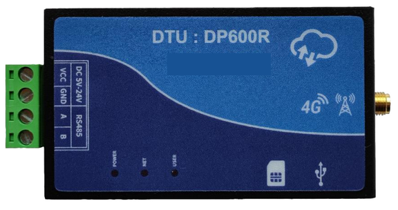

# QuecPython DTU Solution

[中文](readme_zh.md) | English

Welcome to the QuecPython DTU Solution repository! This repository provides a comprehensive solution for developing DTU device applications using QuecPython.

## Table of Contents

- [Introduction](#introduction)
- [Features](#features)
- [Getting Started](#getting-started)
  - [Prerequisites](#prerequisites)
  - [Installation](#installation)
  - [Running the Application](#running-the-application)
- [Directory Structure](#directory-structure)
- [Usage](#usage)
- [Contributing](#contributing)
- [License](#license)
- [Support](#support)

## Introduction

QuecPython has launched a solution for DTU, including multi-protocol data transmission (TCP/UDP/MQTT/HTTP, etc.), integration with common cloud platforms, and support for parameter configuration of DTU using upper computer tools.



## Features

- **Multi-Protocol Data Transmission**: Supports data transmission via TCP/UDP/MQTT/HTTP protocols, configurable as command mode or transparent transmission mode.
- **Integration with Common Cloud Platforms**: Supports integration with Alibaba Cloud, Tencent Cloud, Huawei Cloud, AWS, and other cloud platforms.
- **Parameter Configuration and Storage**: Supports parameter configuration of the device using a dedicated DTU tool, with persistent storage on the device.

## Getting Started

### Prerequisites

Before you begin, ensure you have the following prerequisites:

- **Hardware**:
  - QuecPython development board kit or DTU device.
    > Click for DTU EVB's [schematic](https://images.quectel.com/python/2024/10/DP-DTU-Q600-EVB-V1.3-SCH.pdf) and [silk screen](https://images.quectel.com/python/2024/10/DP-DTU-Q600-EVB-V1.3-SilkScreen.pdf) documents.
  - USB Data Cable (USB-A to USB-C).
  - PC (Windows 7, Windows 10, or Windows 11).

- **Software**:
  - USB driver for the QuecPython module.
  - QPYcom debugging tool.
  - QuecPython firmware and related software resources.
  - Python text editor (e.g., [VSCode](https://code.visualstudio.com/), [Pycharm](https://www.jetbrains.com/pycharm/download/)).

### Installation

1. **Clone the Repository**:
   ```bash
   git clone https://github.com/QuecPython/solution-DTU.git
   cd solution-DTU
   ```

2. **Flash the Firmware**:
   Follow the [instructions](https://python.quectel.com/doc/Application_guide/en/dev-tools/QPYcom/qpycom-dw.html#Download-Firmware) to flash the firmware to the development board.

### Running the Application

1. **Connect the Hardware**:
   - Use a USB data cable to connect the development board to the computer's USB port.

2. **Download Code to the Device**:
   - Launch the QPYcom debugging tool.
   - Connect the data cable to the computer.
   - Press the **PWRKEY** button on the development board to start the device.
   - Follow the [instructions](https://python.quectel.com/doc/Application_guide/en/dev-tools/QPYcom/qpycom-dw.html#Download-Script) to import all files within the `code` folder into the module's file system, preserving the directory structure.

3. **Run the Application**:
   - Select the `File` tab.
   - Select the `dtu.py` script.
   - Right-click and select `Run` or use the run shortcut button to execute the script.

## Directory Structure

```plaintext
solution-DTU/
├── CHANGELOG.md
├── code/
│   ├── __init__.py
│   ├── dtu.py
│   ├── dtu_config.json
│   ├── dtu_transaction.py
│   ├── modules/
│   │   ├── __init__.py
│   │   ├── aliyunIot.py
│   │   ├── common.py
│   │   ├── history.py
│   │   ├── huawei_cloud.py
│   │   ├── logging.py
│   │   ├── mqttIot.py
│   │   ├── net_manager.py
│   │   ├── quecthing.py
│   │   ├── remote.py
│   │   ├── serial.py
│   │   ├── socketIot.py
│   │   └── txyunIot.py
│   ├── settings.py
│   └── settings_user.py
├── docs/
│   ├── en/
│   │   ├── DTU_GUI_Tool_User_Guide.md
│   │   ├── DTU_OTA_Upgrade_User_Guide.md
│   │   ├── DTU_Solution_Development_Guide.md
│   │   └── media/
│   └── zh/
│       ├── DTU GUI 工具使用说明.md
│       ├── DTU OTA 升级用户指导手册.md
│       ├── DTU 公版方案用户开发手册.md
│       └── media/
├── dtu_tool/
│   ├── build.sh
│   ├── cloud_config.py
│   ├── dtu_tool.py
│   ├── LICENSE
│   ├── quectel.ico
│   └── translation/
│       ├── __init__.py
│       ├── language
│       └── zh_CN.json
├── LICENSE
├── readme.md
└── readme_zh.md
```

## Usage

- [DTU Solution Development Guide](./docs/en/DTU_Solution_Development_Guide.md)
- [DTU OTA Upgrade User Guide](./docs/en/DTU_OTA_Upgrade_User_Guide.md)
- [DTU GUI Tool User Guide](./docs/en/DTU_GUI_Tool_User_Guide.md)

## Contributing

We welcome contributions to improve this project! Please follow these steps to contribute:

1. Fork the repository.
2. Create a new branch (`git checkout -b feature/your-feature`).
3. Commit your changes (`git commit -m 'Add your feature'`).
4. Push to the branch (`git push origin feature/your-feature`).
5. Open a Pull Request.

## License

This project is licensed under the Apache License. See the [LICENSE](LICENSE) file for details.

## Support

If you have any questions or need support, please refer to the [QuecPython documentation](https://python.quectel.com/doc) or open an issue in this repository.