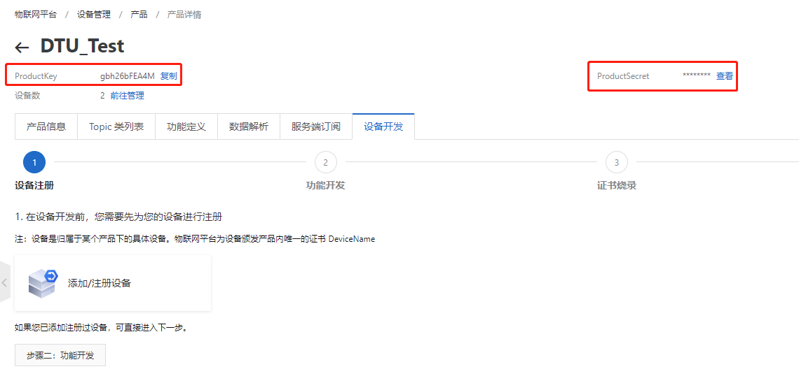

# **DTU上手说明_V2.0**


## 1.基本概述

本文档主要基于介绍DTU上手使用说明。
### 1.1 DTU简介

- 英文全称Data Transfer Unit，数据传输单元。是专门用于将来自于设备端MCU的串口数据通过无线通信网络传送至服务器的无线终端设备。
- 业务逻辑：传感器采集数据发送给设备端MCU，设备端MCU通过串口将采集到的数据通过DTU发送到服务器；服务器接收到数据可以进行分析、处理、显示、保存等操作。


### 1.2 DTU产品线

目前支持DTU的模组列表：

- EC200U_CNLB
- EC200U_EUAB
- EC600U_CNLB
- EC600U_CNLC
- EC600N_CNLA
- EC600N_CNLC
- EC600S_CNLA
- EC600S_CNLB
  
### 1.3 DTU功能

- **支持本地参数配置**
- **通道支持TCP、MQTT、阿里云、腾讯云、移远云多种协议和云平台**
- **支持OTA升级**
- **支持数据离线存储**
	- 在网络连接不稳定情况下，将发送失败的数据暂存至本地，在网络恢复后优先将本地数据发送至云端
  
## 2.使用前准备

本案例使用EC600N开发板与CP2102 USB to TTL模块进行调试
### 2.1 在NANO SIM卡座中插入SIM卡


### 2.2. 将天线插入至开发板背面标注为"LTE"的插座中，并用力压紧直到听到"啪"一声


### 2.3. USB转串口线连接
使用3根杜邦线分别连接CP2102的TX，RX和GND针脚


将CP2102的TX引出线连接至EC600N开发板的RX0针脚（编号7），将CP2102的RX引出线连接至开发板的TX0针脚（编号6），将CP2101的GND引出线连接至开发板的GND针脚（编号1）


将CP2102连接至电脑的USB口。

### 2.4. 使用USB数据线连接开发板至电脑USB接口
### 2.5. 设备开机与QPYcom下载请点击以下连接查看说明

[QuecPython开发环境搭建](https://python.quectel.com/doc/doc/Quick_start/zh/QuecPythonStart/dev_env.html)

### 2.6. 获得阿里云连接参数

用户需要在阿里云上注册账户，新建项目，注册设备名称并获得以下参数

设备名称(Devicename)

产品名称（ProductKey）

设备秘钥（DeviceSecret）：使用一机一密认证时需要提供的参数，使用一型一密时不存在此参数

产品秘钥（ProductSecret）：使用一型一密认证时需要提供的参数，使用一机一密时不存在此参数

获得阿里云pk/ps



获得DeviceName


## 3. 实验操作

### 3.1 打开代码库中的DTU文件夹，按需求编写配置文件

**配置文件格式与说明如下**

```json
{
    "system_config":
    {
        "cloud": "aliyun", # 云名称：quecthing、aliyun、txyun、hwyun、tcp_private_cloud、mqtt_private_cloud
        "usr_config": false,  # 是否启用用户配置模块，本项目暂无
        "base_function":      # 基础功能配置
        {
            "logger": true,   # log打印功能是否开启
            "offline_storage": true, # 网络中断历史数据存储开启
            "fota":true,     # 固件升级是否开启
            "sota":true      # 项目脚本文件升级是否开启
        },
        "peripheral_device":{}, # 外设，本项目暂无
        "peripheral_bus":   # 外设总线
        {
            "uart":0        # 串口0
        }
    },
    "usr_config": #用户配置具体配置项
    {
    
    },
    "aliyun_config": # 阿里云配置
    {	
        "server": "gzsi5zT5fH3.iot-as-mqtt.cn-shanghai.aliyuncs.com",
        "DK": "dtu_device1",                        # 设备名称
        "PK": "gzsi5zT5fH3",                        # 产品KEY
        "DS": "173f006cab770615346978583ac430c0",   # 设备密钥
        "PS": "D07Ujh1RvKAs6KEY",                   # 产品密钥
        "burning_method": 1,                        # 0：一型一密， 1：一机一密
        "keep_alive": 300,                          # 通信之间允许的最长时间段(以秒为单位), 范围(60-1200)
        "clean_session": false,                     # 清除会话
        "qos": 1,                                   # mqtt qos（服务质量）
        "client_id": "",                            # 自定义阿里云连接id，默认为模块IMEI号
        "subscribe": {"0": "/gzsi5zT5fH3/dtu_device1/user/get"},    # 订阅Topic字典，key值代表Topic id。
        "publish": {"0": "/gzsi5zT5fH3/dtu_device1/user/update"}    # 发布Topic字典，key值代表Topic id。
    },
    "txyun_config": # 腾讯云配置
    {	
        "DK": "dtu_device1",                    
        "PK": "I81T7DUSFF",                     
        "DS": "wF+b5NwEHI53crHmOqdyQA==",       
        "PS": "",                               
        "burning_method": 1,                    
        "keep_alive": 300,                      
        "clean_session": false,
        "qos": 1,
        "client_id":"",
        "subscribe": {"0": "I81T7DUSFF/dtu_device1/control"},
        "publish": {"0": "I81T7DUSFF/dtu_device1/event"}
    },
    "hwyun_config":
    {	
        "server": "a15fbbd7ce.iot-mqtts.cn-north-4.myhuaweicloud.com",
        "port": "1883",
        "DK": "625132b420cfa22b94c54613_dtu_device1_id",
        "PK": "",
        "DS": "a306255686a71e56ad53965fc2771bf8",
        "PS": "",
        "keep_alive": 300,
        "clean_session": false,
        "qos": 1,
        "subscribe": {"0": "$oc/devices/625132b420cfa22b94c54613_dtu_device1_id/sys/messages/down"},
        "publish": {"0": "$oc/devices/625132b420cfa22b94c54613_dtu_device1_id/sys/messages/up"}
    },
    "quecthing_config":
    {	
        "server":"iot-south.quectel.com",
        "port": "1883",
        "DK": "dtudevice1",
        "PK": "p11nKG",
        "DS": "",
        "PS": "TVRBd2FPaVk2Ny85",
        "keep_alive": 300,
        "clean_session": false,
        "qos": 1
    },
    "tcp_private_cloud_config":
    {
        "ip_type":"IPv4",
        "server": "220.180.239.212",
        "port": "18011",
        "keep_alive": 5 # 设置TCP保活包间隔时间，value 单位为分钟，范围：1-120
    },
    "mqtt_private_cloud_config":
    {
        "server": "a15fbbd7ce.iot-mqtts.cn-north-4.myhuaweicloud.com",
        "port": "1883",
        "client_id": "",
        "clean_session": false,
        "qos": "0",
        "keep_alive": 300,
        "subscribe": {"0": "oc/devices/625132b420cfa22b94c54613_dtu_device1_id/sys/messages/down"},
        "publish": {"0": "oc/devices/625132b420cfa22b94c54613_dtu_device1_id/sys/messages/up"}
    },
    "uart_config":
    {
        "baudrate": "115200",   # 波特率，常用波特率都支持，如4800、9600、19200、38400、57600、115200、230400等
        "databits": "8",        # 数据位（5 ~ 8），展锐平台当前仅支持8位
        "parity": "0",          # 奇偶校验（0 – NONE，1 – EVEN，2 - ODD）
        "stopbits": "1",        # 停止位（1 ~ 2）
        "flowctl": "0",         # 硬件控制流（0 – FC_NONE， 1 – FC_HW）
        "rs485_direction_pin": "8"   #使用RS485协议时，设置控制RX/TX方向引脚
    }
}
```
**注：**
 **1. MQTT协议配置中发布Topic字典中必须有key为"0"的Topic，在向云端发送历史数据时默认使用Topic id为"0"的Topic。
 2. MQTT协议中keep_alive配置单位为秒（s），TCP协议中keep_alive配置单位为分钟（min）**

按需求编写配置文件后将配置文件保存为"dtu_config.json"，并保存至DTU代码库中的"dtu"文件。
**注：json文件保存前需要移除注释**

### 3.2 下载代码到设备

#### 3.2.1 接上数据线，连接至电脑，短按开发板上的"PWK"按键启动设备，并在QPYcom上选择USB串行设备口连接


#### 3.2.2 切换到下载选项卡，点击创建项目，并输入任意项目名称


#### 3.2.3 将代码包"dtu"文件夹内所有文件拖入此框内，并应包含图示文件


#### 3.2.4 单击箭头，选择"下载脚本"，并等待下载完成


#### 3.2.5 切换至"文件"选项卡，在右边选中"dtu.py"，点击运行按钮，即可开始dtu调试运行，如果需要上电自动运行，只需要将"dtu.py"更名为"main.py"即可实现上电自动运行


DTU运行成功，下面为读取的配置文件。


### 3.3 向云端发送消息

#### 3.3.1 打开串口调试工具，选择CP210X USB to UART 连接至CP2102转换板，并打开串口


#### 3.3.2 在uart调试工具中按指定格式传入topic_id, msg_length, msg, 需要发送的数据，并点击"发送";


#### 3.3.3 DTU收到数据，并发送至云端

#### 3.3.4 云端接收到的消息


### 3.4 云端向设备发送信息

#### 3.4.1 在阿里云topic列表中向自定义topic发送消息


#### 3.4.2 DTU成功收到消息并向串口透传数据


#### 3.4.3 串口收到透传消息


## 4 .报文格式
### 4.1 与MCU通信报文
针对和云端通信协议的不同，模块和外部设备（如MCU）通信协议也会不同。
当模块和云端通信使用TCP协议时，由于TCP和串口都是数据流的形式，所以直接透传数据，不做任何处理；当模块和云端通信使用MQTT协议时，
为了区分不同的数据帧，模块的串口对外协议采用简单的数据帧：`<topic_id>,<msg_len>,<msg_data>"`。
**注：移远云不支持Topic设置，`<topic_id>`统一为`"0"`**

**示例报文：**

- 上行报文：

`“1,6,abcedf”`

- 下行报文：

`“1,6,ijklmn”`

模块和外部设备（MCU）上行报文和下行报文都是采用字符串格式，数据项之间采用`,`相隔。


### 4.2 与云端通信报文

DTU与云端通信报文使用字符串格式


 