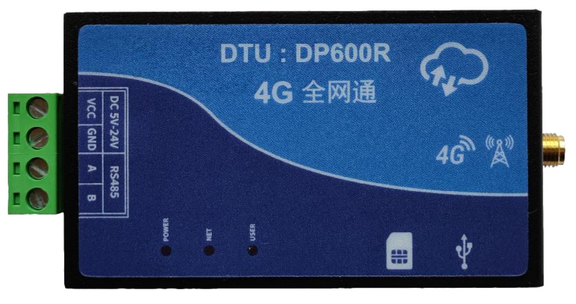

# QuecPython DTU 解决方案

中文 | [English](readme.md)

欢迎来到 QuecPython DTU 解决方案仓库！本仓库提供了一个全面的解决方案，用于使用 QuecPython DTU 设备应用程序。

## 目录

- [介绍](#介绍)
- [功能](#功能)
- [快速开始](#快速开始)
  - [先决条件](#先决条件)
  - [安装](#安装)
  - [运行应用程序](#运行应用程序)
- [目录结构](#目录结构)
- [使用](#使用)
- [贡献](#贡献)
- [许可证](#许可证)
- [支持](#支持)

## 介绍

QuecPython 推出了针对 DTU 的解决方案，包括多种协议的数据传输（TCP/UDP/MQTT/HTTP等）、常见云平台的对接、支持使用上位机对 DTU 进行参数配置等功能。



## 功能

- **多种协议的数据传输**：支持TCP/UDP/MQTT/HTTP等协议的数据传输，可配置为命令模式或透传模式。
- **常见云平台的对接**：支持阿里云、腾讯云、华为云、AWS等云平台的对接。
- **参数配置与存储**：支持使用专门的 DTU 工具对设备做参数配置，并持久化存储于设备中。

## 快速开始

### 先决条件

在开始之前，请确保您具备以下先决条件：

- **硬件**：
  - QuecPython 开发板套件或 DTU 设备
  - USB 数据线（USB-A 转 USB-C）
  - 电脑（Windows 7、Windows 10 或 Windows 11）

- **软件**：
  - QuecPython 模块的 USB 驱动
  - QPYcom 调试工具
  - QuecPython 固件及相关软件资源
  - Python 文本编辑器（例如，[VSCode](https://code.visualstudio.com/)、[Pycharm](https://www.jetbrains.com/pycharm/download/)）

### 安装

1. **克隆仓库**：
   ```bash
   git clone https://github.com/QuecPython/solution-DTU.git
   cd solution-DTU
   ```

2. **烧录固件**：
   按照[说明](https://python.quectel.com/doc/Application_guide/zh/dev-tools/QPYcom/qpycom-dw.html#Download-Firmware)将固件烧录到开发板上。

### 运行应用程序

1. **连接硬件**：
   - 使用 USB 数据线将开发板连接到计算机的 USB 端口。

2. **将代码下载到设备**：
   - 启动 QPYcom 调试工具。
   - 将数据线连接到计算机。
   - 按下开发板上的 **PWRKEY** 按钮启动设备。
   - 按照[说明](https://python.quectel.com/doc/Application_guide/zh/dev-tools/QPYcom/qpycom-dw.html#Download-Script)将 `code` 文件夹中的所有文件导入到模块的文件系统中，保留目录结构。

3. **运行应用程序**：
   - 选择 `File` 选项卡。
   - 选择 `dtu.py` 脚本。
   - 右键单击并选择 `Run` 或使用`运行`快捷按钮执行脚本。

## 目录结构

```plaintext
solution-DTU/
├── CHANGELOG.md
├── code/
│   ├── __init__.py
│   ├── dtu.py
│   ├── dtu_config.json
│   ├── dtu_transaction.py
│   ├── modules/
│   │   ├── __init__.py
│   │   ├── aliyunIot.py
│   │   ├── common.py
│   │   ├── history.py
│   │   ├── huawei_cloud.py
│   │   ├── logging.py
│   │   ├── mqttIot.py
│   │   ├── net_manager.py
│   │   ├── quecthing.py
│   │   ├── remote.py
│   │   ├── serial.py
│   │   ├── socketIot.py
│   │   └── txyunIot.py
│   ├── settings.py
│   └── settings_user.py
├── docs/
│   ├── en/
│   │   ├── DTU_GUI_Tool_User_Guide.md
│   │   ├── DTU_OTA_Upgrade_User_Guide.md
│   │   ├── DTU_Solution_Development_Guide.md
│   │   └── media/
│   └── zh/
│       ├── DTU GUI 工具使用说明.md
│       ├── DTU OTA 升级用户指导手册.md
│       ├── DTU 公版方案用户开发手册.md
│       └── media/
├── dtu_tool/
│   ├── build.sh
│   ├── cloud_config.py
│   ├── dtu_tool.py
│   ├── LICENSE
│   ├── quectel.ico
│   └── translation/
│       ├── __init__.py
│       ├── language
│       └── zh_CN.json
├── LICENSE
├── readme.md
└── readme_zh.md
```

## 使用

- [DTU 公版方案用户开发手册](./docs/zh/DTU%20公版方案用户开发手册.md)
- [DTU OTA 升级用户指导手册](./docs/zh/DTU%20OTA%20升级用户指导手册.md)
- [DTU GUI 工具使用说明](./docs/zh/DTU%20GUI%20工具使用说明.md)

## 贡献

我们欢迎对本项目的改进做出贡献！请按照以下步骤进行贡献：

1. Fork 此仓库。
2. 创建一个新分支（`git checkout -b feature/your-feature`）。
3. 提交您的更改（`git commit -m 'Add your feature'`）。
4. 推送到分支（`git push origin feature/your-feature`）。
5. 打开一个 Pull Request。

## 许可证

本项目使用 Apache 许可证。详细信息请参阅 [LICENSE](LICENSE) 文件。

## 支持

如果您有任何问题或需要支持，请参阅 [QuecPython 文档](https://python.quectel.com/doc) 或在本仓库中打开一个 issue。